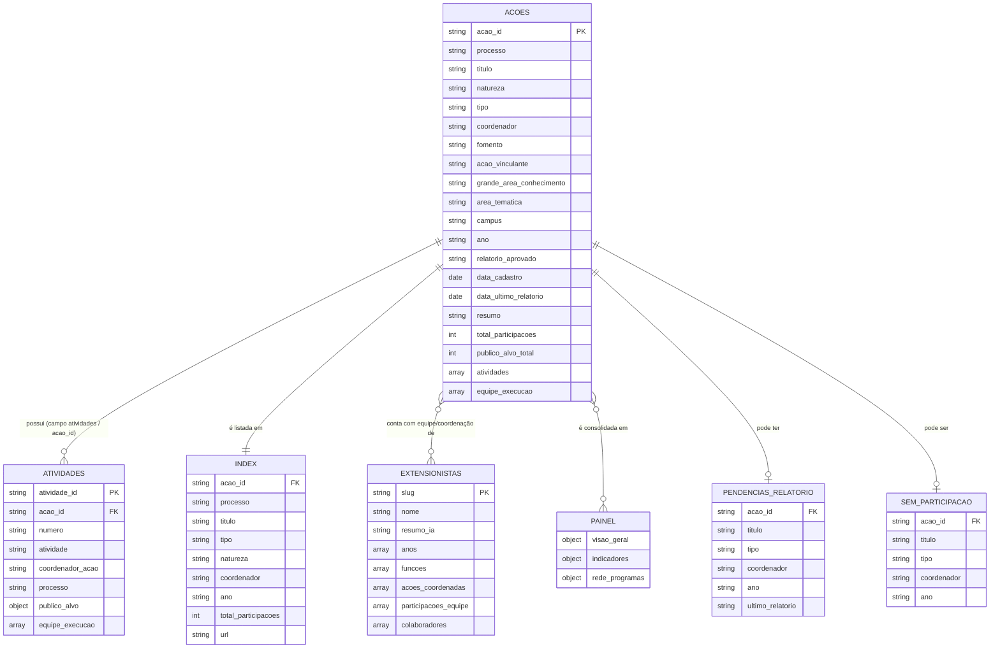

```mermaid
erDiagram
    ACOES ||--o{ ATIVIDADES : "possui (campo atividades / acao_id)"
    ACOES ||--|| INDEX : "é listada em"
    ACOES }o--o{ EXTENSIONISTAS : "conta com equipe/coordenação de"
    ACOES }o--o{ PAINEL : "é consolidada em"
    ACOES ||--o| PENDENCIAS_RELATORIO : "pode ter"
    ACOES ||--o| SEM_PARTICIPACAO : "pode ser"

    ACOES {
        string acao_id PK
        string processo
        string titulo
        string natureza
        string tipo
        string coordenador
        string fomento
        string acao_vinculante
        string grande_area_conhecimento
        string area_tematica
        string campus
        string ano
        string relatorio_aprovado
        date data_cadastro
        date data_ultimo_relatorio
        string resumo
        int total_participacoes
        int publico_alvo_total
        array atividades
        array equipe_execucao
    }

    ATIVIDADES {
        string atividade_id PK
        string acao_id FK
        string numero
        string atividade
        string coordenador_acao
        string processo
        object publico_alvo
        array equipe_execucao
    }

    EXTENSIONISTAS {
        string slug PK
        string nome
        string resumo_ia
        array anos
        array funcoes
        array acoes_coordenadas
        array participacoes_equipe
        array colaboradores
    }

    INDEX {
        string acao_id FK
        string processo
        string titulo
        string tipo
        string natureza
        string coordenador
        string ano
        int total_participacoes
        string url
    }

    PAINEL {
        object visao_geral
        object indicadores
        object rede_programas
    }

    PENDENCIAS_RELATORIO {
        string acao_id FK
        string titulo
        string tipo
        string coordenador
        string ano
        string ultimo_relatorio
    }

    SEM_PARTICIPACAO {
        string acao_id FK
        string titulo
        string tipo
        string coordenador
        string ano
    }
```
