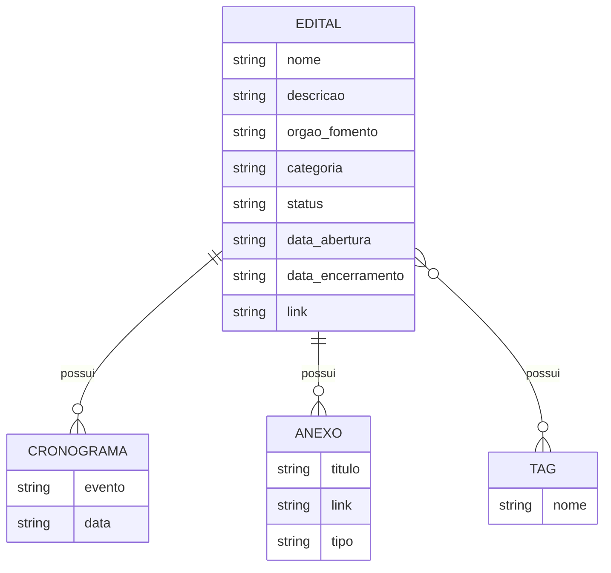

# Modelo Conceitual — Portal de Editais

> Entidades e relacionamentos extraídos das bases JSON utilizadas pelo Portal de Editais.
> A pasta `data/` contém 58 arquivos JSON com a mesma estrutura de registro de edital.

---

## Diagrama ER

# Entidades

| Entidade       | Descrição                               | Origem        |
| -------------- | --------------------------------------- | ------------- |
| **EDITAL**     | Informações principais do edital        | `data/*.json` |
| **CRONOGRAMA** | Eventos e prazos relacionados ao edital | `cronograma`  |
| **ANEXO**      | Documentos relacionados ao edital       | `anexos`      |
| **TAG**        | Palavras-chave associadas ao edital     | `tags`        |
