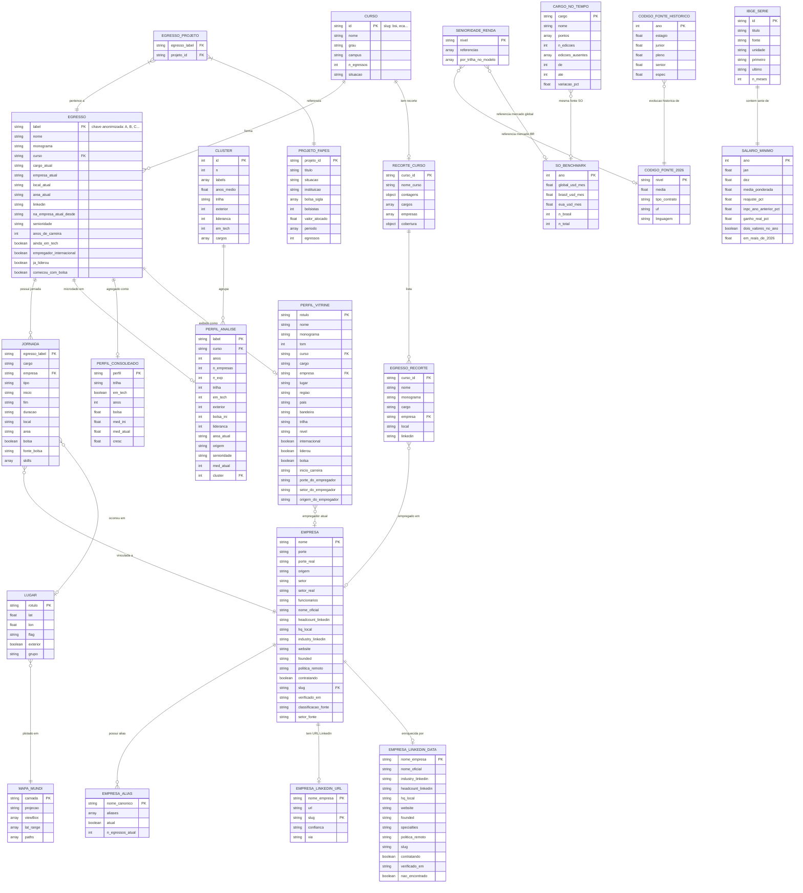

```mermaid
erDiagram

    CURSO {
        string id PK "slug: bsi, eca..."
        string nome
        string grau
        string campus
        int n_egressos
        string situacao
    }

    EGRESSO {
        string label PK "chave anonimizada: A, B, C..."
        string nome
        string monograma
        string curso FK
        string cargo_atual
        string empresa_atual
        string local_atual
        string area_atual
        string linkedin
        string na_empresa_atual_desde
        string senioridade
        int anos_de_carreira
        boolean ainda_em_tech
        boolean empregador_internacional
        boolean ja_liderou
        boolean comecou_com_bolsa
    }

    JORNADA {
        string egresso_label FK
        string cargo
        string empresa FK
        string tipo
        string inicio
        string fim
        string duracao
        string local
        string area
        boolean bolsa
        string fonte_bolsa
        array skills
    }

    EMPRESA {
        string nome PK
        string porte
        string porte_real
        string origem
        string setor
        string setor_real
        string funcionarios
        string nome_oficial
        string headcount_linkedin
        string hq_local
        string industry_linkedin
        string website
        string founded
        string politica_remoto
        boolean contratando
        string slug FK
        string verificado_em
        string classificacao_fonte
        string setor_fonte
    }

    EMPRESA_ALIAS {
        string nome_canonico PK
        array aliases
        boolean atual
        int n_egressos_atual
    }

    EMPRESA_LINKEDIN_URL {
        string nome_empresa PK
        string url
        string slug PK
        string confianca
        string via
    }

    EMPRESA_LINKEDIN_DATA {
        string nome_empresa PK
        string nome_oficial
        string industry_linkedin
        string headcount_linkedin
        string hq_local
        string website
        string founded
        string specialties
        string politica_remoto
        string slug
        boolean contratando
        string verificado_em
        boolean nao_encontrado
    }

    PERFIL_ANALISE {
        string label PK
        string curso FK
        int anos
        int n_empresas
        int n_exp
        int trilha
        int em_tech
        int exterior
        int bolsa_ini
        int lideranca
        string area_atual
        string origem
        string senioridade
        int med_atual
        int cluster FK
    }

    CLUSTER {
        int id PK
        int n
        array labels
        float anos_medio
        string trilha
        int exterior
        int lideranca
        int em_tech
        array cargos
    }

    PERFIL_CONSOLIDADO {
        string perfil PK
        string trilha
        boolean em_tech
        int anos
        float bolsa
        float med_ini
        float med_atual
        float cresc
    }

    PERFIL_VITRINE {
        string rotulo PK
        string nome
        string monograma
        int tom
        string curso FK
        string cargo
        string empresa FK
        string lugar
        string regiao
        string pais
        string bandeira
        string trilha
        string nivel
        boolean internacional
        boolean liderou
        boolean bolsa
        string inicio_carreira
        string porte_do_empregador
        string setor_do_empregador
        string origem_do_empregador
    }

    PROJETO_FAPES {
        string projeto_id PK
        string titulo
        string situacao
        string instituicao
        array bolsa_sigla
        int bolsistas
        float valor_alocado
        array periodo
        int egressos
    }

    EGRESSO_PROJETO {
        string egresso_label FK
        string projeto_id FK
    }

    SENIORIDADE_RENDA {
        string nivel PK
        array referencias
        array por_trilha_no_modelo
    }

    CARGO_NO_TEMPO {
        string cargo PK
        string nome
        array pontos
        int n_edicoes
        array edicoes_ausentes
        int de
        int ate
        float variacao_pct
    }

    SO_BENCHMARK {
        int ano PK
        float global_usd_mes
        float brasil_usd_mes
        float eua_usd_mes
        int n_brasil
        int n_total
    }

    CODIGO_FONTE_2026 {
        string nivel PK
        float media
        string tipo_contrato
        string uf
        string linguagem
    }

    CODIGO_FONTE_HISTORICO {
        int ano PK
        float estagio
        float junior
        float pleno
        float senior
        float espec
    }

    SALARIO_MINIMO {
        int ano PK
        float jan
        float dez
        float media_ponderada
        float reajuste_pct
        float inpc_ano_anterior_pct
        float ganho_real_pct
        boolean dois_valores_no_ano
        float em_reais_de_2026
    }

    IBGE_SERIE {
        string id PK
        string titulo
        string fonte
        string unidade
        string primeiro
        string ultimo
        int n_meses
    }

    LUGAR {
        string rotulo PK
        float lat
        float lon
        string flag
        boolean exterior
        string grupo
    }

    MAPA_MUNDI {
        string camada PK
        string projecao
        array viewBox
        array lat_range
        array paths
    }

    RECORTE_CURSO {
        string curso_id PK
        string nome_curso
        object contagens
        array cargos
        array empresas
        object cobertura
    }

    EGRESSO_RECORTE {
        string curso_id FK
        string nome
        string monograma
        string cargo
        string empresa FK
        string local
        string linkedin
    }

    CURSO ||--o{ EGRESSO : "forma"
    CURSO ||--o| RECORTE_CURSO : "tem recorte"
    EGRESSO ||--o{ JORNADA : "possui jornada"
    JORNADA }o--|| EMPRESA : "vinculada a"
    PERFIL_VITRINE }o--o| EMPRESA : "empregador atual"
    EGRESSO ||--o| PERFIL_ANALISE : "microdado em"
    EGRESSO ||--o| PERFIL_CONSOLIDADO : "agregado como"
    EGRESSO ||--o| PERFIL_VITRINE : "exibido como"
    CLUSTER ||--o{ PERFIL_ANALISE : "agrupa"
    EMPRESA ||--o{ EMPRESA_ALIAS : "possui alias"
    EMPRESA ||--o| EMPRESA_LINKEDIN_URL : "tem URL LinkedIn"
    EMPRESA ||--o| EMPRESA_LINKEDIN_DATA : "enriquecida por"
    EGRESSO_PROJETO }|--|| EGRESSO : "pertence a"
    EGRESSO_PROJETO }|--|| PROJETO_FAPES : "referencia"
    SENIORIDADE_RENDA }o--o| CODIGO_FONTE_2026 : "referencia mercado BR"
    SENIORIDADE_RENDA }o--o| SO_BENCHMARK : "referencia mercado global"
    CARGO_NO_TEMPO }o--o| SO_BENCHMARK : "mesma fonte SO"
    CODIGO_FONTE_HISTORICO }o--|| CODIGO_FONTE_2026 : "evolucao historica de"
    IBGE_SERIE ||--|| SALARIO_MINIMO : "contem serie de"
    LUGAR }o--|| MAPA_MUNDI : "plotado em"
    JORNADA }o--o| LUGAR : "ocorreu em"
    RECORTE_CURSO ||--o{ EGRESSO_RECORTE : "lista"
    EGRESSO_RECORTE }o--o| EMPRESA : "empregado em"
```    
