# Modelo Conceitual Integrado de Dados: Diretoria, SRC e Horizon (IFES Campus Serra)

## 1. Visão Geral e Contexto da Integração

O ecossistema de dados do IFES Campus Serra é composto por múltiplos sistemas independentes que cobrem diferentes verticais acadêmicas e administrativas:
- **Diretoria & SRC (Extensão e Ensino)**: Extraído do *Sistema de Registro e Emissão de Certificados (SRC)* e publicado como API estática e relatórios da Diretoria. Concentra ações de extensão/ensino, atividades curriculares, histórico de extensionistas (docentes, discentes e convidados), público-alvo atendido e indicadores de impacto.
- **Horizon (Pesquisa e Pós-Graduação)**: Plataforma integrada de pesquisa e governança institucional, consolidando dados do *SIGPesq*, *Plataforma Lattes/CNPq* e publicações acadêmicas em arquivos colunares Parquet e agregados JSON.

Para atender à necessidade de identificação visual inequívoca da proveniência de cada entidade e de rastreabilidade ponta a ponta dos atributos, este modelo adota uma **convenção explícita de prefixos** nos nomes de todas as tabelas:
- **`SRC_Di_`**: Entidade unificada com dados e estrutura originários conjuntamente de **SRC** e **Diretoria** (ex.: `SRC_Di_Extensionista`, `SRC_Di_Acao_Extensao`).
- **`SRC_`**: Entidade com dados e estrutura originários exclusivamente de **SRC** (ex.: `SRC_Tema_Nicho_Extensao`).
- **`Horizon_`**: Entidade canônica, relacional ou de governança originária do **Horizon** (ex.: `Horizon_Pessoa`, `Horizon_Iniciativa_Pesquisa`).
*(Nota: O sistema Diretoria não possui tabelas estruturais exclusivas que não estejam presentes no SRC; todos os arquivos de dados da Diretoria foram integrados no prefixo `SRC_Di_`).*

### Diretrizes Centrais do Modelo:
1. **Unificação sem duplicidade**: Tabelas e atributos idênticos ou equivalentes entre **Diretoria** e **SRC** foram fundidos em uma única entidade concentradora com a totalidade dos atributos de ambas as fontes.
2. **Fidelidade aos dados reais**: Não foram inventadas tabelas artificiais, nem chaves primárias (PK) ou estrangeiras (FK) que não existam ou não façam sentido nos dados brutos. Tabelas sem vínculo referencial direto com outras foram mantidas soltas (*standalone*).
3. **Rastreabilidade por atributo**: Cada atributo documentado traz seu sistema de origem (`SRC`, `Diretoria`, `SRC e Diretoria`, ou `Horizon`) e o arquivo/JSON de origem correspondente.
4. **Isolamento de escopo**: Bases de Egressos, Editais e GeDoc foram expressamente excluídas do escopo.
5. **Sem fontes externas**: Utilizou-se estritamente os arquivos e dicionários locais presentes na pasta do projeto.

---

## 2. Análise de Entidades e Atributos em Comum

### 2.1. Entidades em Comum e Cruzamentos Semânticos

| Entidade Conceitual | Tabela Integrada SRC / Diretoria | Tabela Integrada Horizon | Grau de Correspondência | Observações sobre Chaves e Cruzamento |
| :--- | :--- | :--- | :--- | :--- |
| **Pessoa / Agente Acadêmico** | `SRC_Di_Extensionista` (`api/extensionistas/*.json`) | `Horizon_Pessoa` (`researchers_canonical.parquet` / `pessoas_canonical`) | **Conceitual Alto** (Mesmo indivíduo físico) | Em Horizon a PK é `id` (Int64). Em SRC/Diretoria a PK é `slug` (String). O cruzamento real ocorre por chave natural (`nome` / `name`), catalogado pelo Horizon via `entity_matches_canonical` (`canonical_name`). |
| **Iniciativa / Projeto** | `SRC_Di_Acao_Extensao` (`api/acoes/*.json`) | `Horizon_Iniciativa_Pesquisa` (`initiatives_canonical.parquet`) | **Conceitual Médio** (Tipos distintos de projeto) | Ambas representam projetos institucionais com equipe, coordenador, resumo e campus. Porém, `SRC_Di_Acao_Extensao` vem do SIPAC/SRC (Extensão/Ensino) e `Horizon_Iniciativa_Pesquisa` do SIGPesq (Pesquisa). Foram mantidas como entidades distintas para preservar a integridade dos atributos específicos de cada ecossistema. |
| **Campus** | `campus: "Serra"` (atributo textual desnormalizado) | `Horizon_Campus` (`campuses_canonical.parquet`: `id: 6`) | **Conceitual Alto** | Ambas se referem às unidades do IFES. No Horizon é uma tabela canônica estruturada com hierarquia; no SRC/Diretoria é um atributo denormalizado fixo no Campus Serra. |
| **Área do Conhecimento** | `grande_area`, `area_tematica` | `Horizon_Area_Conhecimento` (`knowledge_areas_canonical.parquet`) | **Conceitual Alto** | Ambas utilizam a taxonomia oficial de áreas do CNPq/CAPES (ex.: Educação, Ciências Sociais Aplicadas, Ciência da Computação). |
| **Fomento / Financiamento** | `fomento` (PAEX-IFES, PRONATEC, Mulheres Mil, Sem Vínculo) | `Horizon_Programa_Bolsa` (`fellowships_canonical.parquet`: PIVIC, PIBIC, etc.) | **Conceitual Médio** | Horizon foca em bolsas de pesquisa acadêmica; SRC/Diretoria foca em programas de fomento institucional à extensão. |

---

## 3. Modelo Entidade-Relacionamento Conceitual (Mermaid)

```mermaid
erDiagram
    Horizon_Organizacao ||--o{ Horizon_Campus : "possui"
    Horizon_Campus ||--o{ Horizon_Campus : "subordina (hierarquia)"
    Horizon_Campus ||--o{ Horizon_Pessoa : "aloca"
    Horizon_Campus ||--o{ Horizon_Iniciativa_Pesquisa : "sedia"
    Horizon_Campus ||--o{ Horizon_Grupo_Pesquisa : "sedia"
    Horizon_Campus ||--o{ Horizon_Artigo : "vincula"

    Horizon_Organizacao ||--o{ Horizon_Iniciativa_Pesquisa : "mantem"
    Horizon_Organizacao ||--o{ Horizon_Grupo_Pesquisa : "institui"

    Horizon_Tipo_Iniciativa ||--o{ Horizon_Iniciativa_Pesquisa : "classifica"
    Horizon_Iniciativa_Pesquisa ||--o{ Horizon_Iniciativa_Pesquisa : "vincula_parent (autorrelacionamento)"
    
    Horizon_Iniciativa_Pesquisa ||--o{ Horizon_Membro_Equipe_Iniciativa : "possui_equipe"
    Horizon_Pessoa ||--o{ Horizon_Membro_Equipe_Iniciativa : "integra"

    Horizon_Iniciativa_Pesquisa ||--o{ Horizon_Iniciativa_Area_Conhecimento : "enquadra"
    Horizon_Area_Conhecimento ||--o{ Horizon_Iniciativa_Area_Conhecimento : "abrange"

    Horizon_Grupo_Pesquisa ||--o{ Horizon_Membro_Grupo_Pesquisa : "compoe"
    Horizon_Pessoa ||--o{ Horizon_Membro_Grupo_Pesquisa : "participa"

    Horizon_Grupo_Pesquisa ||--o{ Horizon_Grupo_Area_Conhecimento : "atua_em"
    Horizon_Area_Conhecimento ||--o{ Horizon_Grupo_Area_Conhecimento : "delimita"

    Horizon_Pessoa ||--o{ Horizon_Orientacao : "orientando (person_id)"
    Horizon_Pessoa ||--o{ Horizon_Orientacao : "supervisor (supervisor_id)"
    Horizon_Programa_Bolsa ||--o{ Horizon_Orientacao : "financia"
    Horizon_Campus ||--o{ Horizon_Orientacao : "localiza"

    Horizon_Governanca_Execucao_Ingestao ||--o{ Horizon_Governanca_Log_Alteracao : "registra"

    SRC_Di_Acao_Extensao ||--o{ SRC_Di_Atividade_Extensao : "desdobra_em"
    SRC_Di_Acao_Extensao ||--o{ SRC_Di_Equipe_Execucao_Extensao : "aloca_equipe"
    SRC_Di_Atividade_Extensao ||--o{ SRC_Di_Equipe_Execucao_Extensao : "executa_com"
    
    SRC_Di_Acao_Extensao ||--o{ SRC_Di_Pendencia_Relatorio_Extensao : "acompanha_pendencia"
    SRC_Di_Extensionista ||--o{ SRC_Di_Pendencia_Relatorio_Extensao : "coordena_pendencia"

    SRC_Di_Acao_Extensao ||--o{ SRC_Di_Acao_Sem_Participacao : "sinaliza_vazio"

    SRC_Di_Extensionista ||--o{ SRC_Di_Colaboracao_Extensionista : "colabora_origem"
    SRC_Di_Extensionista ||--o{ SRC_Di_Colaboracao_Extensionista : "colabora_parceiro"

    Horizon_Organizacao {
        int id PK
        string name
        string short_name
        string description
    }

    Horizon_Campus {
        int id PK
        string name
        string short_name
        int organization_id FK
        int parent_id FK
        string description
    }

    Horizon_Tipo_Iniciativa {
        int id PK
        string name
        string description
    }

    Horizon_Area_Conhecimento {
        int id PK
        string name
    }

    Horizon_Programa_Bolsa {
        int id PK
        string name
        float value
        string description
    }

    Horizon_Pessoa {
        int id PK
        string name
        string identification_id
        string classification
        string classification_confidence
        string classification_note
        boolean was_student
        boolean was_staff
        string cnpq_url
        string resume
        string citation_names
        int campus_id FK
    }

    Horizon_Iniciativa_Pesquisa {
        int id PK
        string name
        string status
        string description
        datetime start_date
        datetime end_date
        int initiative_type_id FK
        int organization_id FK
        int parent_id FK
        int campus_id FK
        string sigpesq_code
        string match_strategy
        boolean needs_review
        string linha_pesquisa
        string area_conhecimento_texto
    }

    Horizon_Membro_Equipe_Iniciativa {
        int initiative_id FK
        int person_id FK
        string person_name
        string roles
        datetime start_date
        datetime end_date
    }

    Horizon_Iniciativa_Area_Conhecimento {
        int initiative_id FK
        int knowledge_area_id FK
    }

    Horizon_Grupo_Pesquisa {
        int id PK
        string name
        string short_name
        string description
        string cnpq_url
        string site
        int organization_id FK
        int campus_id FK
    }

    Horizon_Membro_Grupo_Pesquisa {
        int group_id FK
        int person_id FK
        string role
        date start_date
        date end_date
    }

    Horizon_Grupo_Area_Conhecimento {
        int group_id FK
        int knowledge_area_id FK
    }

    Horizon_Orientacao {
        int id PK
        string name
        string status
        string description
        datetime start_date
        datetime end_date
        int person_id FK
        int supervisor_id FK
        int fellowship_id FK
        int campus_id FK
    }

    Horizon_Artigo {
        int id PK
        string title
        string doi
        int year
        string type
        string journal_conference
        string volume
        string pages
        int campus_id FK
    }

    Horizon_Governanca_Execucao_Ingestao {
        int id PK
        string pipeline_name
        string run_status
        string source_system
        string input_snapshot_hash
        datetime started_at
        datetime finished_at
    }

    Horizon_Governanca_Match_Entidade {
        int id PK
        int source_record_id
        string canonical_entity_type
        int canonical_entity_id
        string match_strategy
        string match_confidence
        datetime matched_at
        int campus_id FK
    }

    Horizon_Governanca_Log_Alteracao {
        int id PK
        int ingestion_run_id FK
        int source_record_id
        string canonical_entity_type
        int canonical_entity_id
        string operation
        string changed_fields_json
        string reason
        datetime changed_at
    }

    Horizon_Governanca_Assercao_Atributo {
        int id PK
        int source_record_id
        string canonical_entity_type
        int canonical_entity_id
        string attribute_name
        string value_json
        string value_hash
        boolean is_selected
        string selection_reason
        datetime asserted_at
    }

    SRC_Di_Acao_Extensao {
        string acao_id PK
        string processo
        string titulo
        string tipo
        string natureza
        string coordenador
        string fomento
        string acao_vinculante
        string grande_area
        string grande_area_inferida
        string area_tematica
        string area_tematica_inferida
        string nicho_tematico
        string status_iniciativa
        string relatorio_aprovado
        string data_ultimo_relatorio
        string data_cadastro
        string ano
        int ano_ultima_atividade
        string resumo
        string campus
        int total_participacoes
        int publico_alvo_total
        string url
    }

    SRC_Di_Atividade_Extensao {
        string atividade_id PK
        string acao_id FK
        string numero
        string nome_atividade
        string acao_titulo
        string processo
        string coordenador_acao
        int publico_total
        int publico_aprovados
        int publico_certificados
        string publico_situacao
    }

    SRC_Di_Extensionista {
        string slug PK
        string nome
        string resumo_ia
        string anos
        string funcoes
        int imp_coord
        int imp_eq
        int impacto
        string url
    }

    SRC_Di_Equipe_Execucao_Extensao {
        string acao_id FK
        string atividade_id FK
        string nome_membro
        string funcao
        string vinculo
    }

    SRC_Di_Colaboracao_Extensionista {
        string extensionista_origem_slug FK
        string colaborador_slug FK
        string colaborador_nome
        int acoes_comuns
    }

    SRC_Di_Pendencia_Relatorio_Extensao {
        string acao_id FK
        string titulo
        string tipo
        string coordenador
        string coordenador_slug FK
        string ano
        string inicio
        string termino
        string ultimo_relatorio
        boolean pendente
        int publico
        int equipe
    }

    SRC_Di_Acao_Sem_Participacao {
        string acao_id FK
        string titulo
        string tipo
        string coordenador
        string ano
    }

    SRC_Tema_Nicho_Extensao {
        string tema PK
        string resumo
        int acoes_count
        int publico_total
        int pessoas_total
    }

    SRC_Di_Painel_Indicadores_Extensao {
        int n_acoes
        int n_acoes_ativas
        int total_atividades
        int total_publico
        int total_equipe
        float taxa_certificacao
        int alunos_unicos
        int equipe_unica
        int total_formados
        int formados_em_extensao
        int horas_aluno
    }
```

---

## 4. Catálogo Detalhado de Tabelas e Origem dos Atributos

A seguir, apresenta-se o catálogo minucioso de cada uma das 27 tabelas do modelo integrado, com o mapeamento campo a campo contendo o **sistema de origem** (`SRC`, `Diretoria`, `SRC e Diretoria` ou `Horizon`), o **arquivo / JSON de origem** exato e o **campo original na fonte**.

### 4.1. Tabelas Integradas de Extensão e Ensino (`SRC_Di_` e `SRC_`)

#### 1. `SRC_Di_Acao_Extensao`
- **Sistema(s) da Tabela**: `SRC e Diretoria`
- **Fontes da Tabela**:
  - `diretoria/api/acoes/<acao_id>.json` (201 arquivos)
  - `SRC/api/acoes/<acao_id>.json` (201 arquivos)
  - `diretoria/Dicionario - Diretoria.xlsx` (abas `Diretoria_acoes.json`, `Diretoria_index.json`)
  - `SRC/SRC.xlsx` (abas `SRC_AcoesLista.json`, `SRC_BuscaIndice.json`, `SRC_Investimento.json`)
  - `SRC/api/busca.json` e `SRC/api/investimento.json`
- **Papel e Justificativa de Unificação**: Entidade concentradora das iniciativas de extensão e ensino do IFES Campus Serra. Os arquivos `acoes/*.json` em `diretoria` e `SRC` são rigorosamente os mesmos (hash idêntico). O `SRC` enriquece a entidade com enquadramento estratégico (`nicho`), status de maturidade (`status`) e ano da última atividade (`ano_ultima`).
- **Detalhamento de Atributos e Origens**:

| Atributo | Tipo | Chave | Sistema(s) de Origem | Arquivo / JSON de Origem | Campo Original na Fonte | Descrição |
| :--- | :--- | :--- | :--- | :--- | :--- | :--- |
| `acao_id` | String | PK | SRC e Diretoria | `diretoria/api/acoes/<id>.json`, `SRC/api/acoes/<id>.json` | `acao_id` | Identificador numérico único da ação no SRC. |
| `processo` | String | - | SRC e Diretoria | `diretoria/api/acoes/<id>.json`, `SRC/api/acoes/<id>.json` | `Processo nº` | Número do processo administrativo SIPAC (ex.: `23158.000916/2013-02`). |
| `titulo` | String | - | SRC e Diretoria | `diretoria/api/acoes/<id>.json`, `SRC/api/acoes/<id>.json` | `Título ação` | Título oficial completo da ação. |
| `tipo` | String | - | SRC e Diretoria | `diretoria/api/acoes/<id>.json`, `SRC/api/acoes/<id>.json` | `Tipo ação` | Modalidade da iniciativa (Projeto, Curso, Evento, Programa). |
| `natureza` | String | - | SRC e Diretoria | `diretoria/api/acoes/<id>.json`, `SRC/api/acoes/<id>.json` | `Natureza` | Natureza acadêmica da ação (Extensão, Ensino). |
| `coordenador` | String | - | SRC e Diretoria | `diretoria/api/acoes/<id>.json`, `SRC/api/acoes/<id>.json` | `Coordenador(a)` | Nome do servidor coordenador responsável. |
| `fomento` | String | - | SRC e Diretoria | `diretoria/api/acoes/<id>.json`, `SRC/api/acoes/<id>.json` | `Fomento` | Programa de recurso financeiro (PAEX-IFES, PRONATEC, Mulheres Mil, SEM VÍNCULO). |
| `acao_vinculante` | String | - | SRC e Diretoria | `diretoria/api/acoes/<id>.json`, `SRC/api/acoes/<id>.json` | `Ação vinculante` | Número ou processo da ação-mãe (quando vinculada a um Programa). |
| `grande_area` | String | - | SRC e Diretoria | `diretoria/api/acoes/<id>.json`, `SRC/api/acoes/<id>.json` | `Grande área conhecimento` | Grande área CNPq cadastrada originalmente. |
| `grande_area_inferida` | String | - | SRC e Diretoria | `diretoria/api/acoes/<id>.json`, `SRC/api/acoes/<id>.json` | `Grande área conhecimento (inferida)` | Grande área CNPq inferida via algoritmo institucional. |
| `area_tematica` | String | - | SRC e Diretoria | `diretoria/api/acoes/<id>.json`, `SRC/api/acoes/<id>.json` | `Área temática principal` | Área temática oficial da extensão (ex.: Tecnologia e Produção). |
| `area_tematica_inferida` | String | - | SRC e Diretoria | `diretoria/api/acoes/<id>.json`, `SRC/api/acoes/<id>.json` | `Área temática principal (inferida)` | Área temática inferida por NLP/IA. |
| `nicho_tematico` | String | - | SRC | `SRC/api/investimento.json`, `SRC/api/temas.json` | `iniciativas[].nicho` | Cluster temático analítico (ex.: "Robótica e cultura maker"). |
| `status_iniciativa` | String | - | SRC | `SRC/api/investimento.json` | `iniciativas[].status` | Situação de maturidade operacional (ativa, dormente, intermediária). |
| `relatorio_aprovado` | String | - | SRC e Diretoria | `diretoria/api/acoes/<id>.json`, `SRC/api/acoes/<id>.json` | `Relatório aprovado` | Situação de homologação do relatório final (Sim / Não / null). |
| `data_ultimo_relatorio` | String / Data | - | SRC e Diretoria | `diretoria/api/acoes/<id>.json`, `SRC/api/acoes/<id>.json` | `Data último relatório` | Data do envio do último relatório de prestação de contas. |
| `data_cadastro` | String / Data | - | SRC e Diretoria | `diretoria/api/acoes/<id>.json`, `SRC/api/acoes/<id>.json` | `Data de cadastro` | Data oficial de submissão/cadastro no sistema. |
| `ano` | String | - | SRC e Diretoria | `diretoria/api/pendencias-relatorio.json`, `SRC/api/busca.json` | `ano` | Ano de referência/início da ação. |
| `ano_ultima_atividade` | Int | - | SRC | `SRC/api/investimento.json` | `iniciativas[].ano_ultima` | Ano da última atividade executada dentro da ação. |
| `resumo` | String | - | SRC e Diretoria | `diretoria/api/acoes/<id>.json`, `SRC/api/acoes/<id>.json` | `Resumo` | Texto descritivo dos objetivos e escopo da ação. |
| `campus` | String | - | SRC e Diretoria | `diretoria/api/acoes/<id>.json`, `SRC/api/acoes/<id>.json` | `Campus` | Unidade responsável (Serra). |
| `total_participacoes` | Int | - | SRC e Diretoria | `diretoria/api/acoes/<id>.json`, `SRC/api/acoes/<id>.json` | `total_participacoes` | Volume total de participações contabilizadas na ação. |
| `publico_alvo_total` | Int | - | SRC e Diretoria | `diretoria/api/acoes/<id>.json`, `SRC/api/acoes/<id>.json` | `publico_alvo_total` | Público-alvo total atendido. |
| `url` | String | - | SRC e Diretoria | `diretoria/Dicionario - Diretoria.xlsx`, `SRC/api/investimento.json` | `iniciativas[].url` | Caminho de acesso relativo à documentação web da ação. |

---

#### 2. `SRC_Di_Atividade_Extensao`
- **Sistema(s) da Tabela**: `SRC e Diretoria`
- **Fontes da Tabela**:
  - `diretoria/api/atividades/<atividade_id>.json` (525 arquivos)
  - `SRC/api/atividades/<atividade_id>.json` (525 arquivos)
  - `diretoria/Dicionario - Diretoria.xlsx` (aba `Diretoria_atividades.json`)
- **Papel e Justificativa de Unificação**: Atividades operacionais e cursos/módulos específicos vinculados a uma ação-mãe. Conteúdo idêntico entre os diretórios de Diretoria e SRC.
- **Detalhamento de Atributos e Origens**:

| Atributo | Tipo | Chave | Sistema(s) de Origem | Arquivo / JSON de Origem | Campo Original na Fonte | Descrição |
| :--- | :--- | :--- | :--- | :--- | :--- | :--- |
| `atividade_id` | String | PK | SRC e Diretoria | `diretoria/api/atividades/<id>.json`, `SRC/api/atividades/<id>.json` | `atividade_id` | Identificador numérico da atividade no SRC. |
| `acao_id` | String | FK | SRC e Diretoria | `diretoria/api/atividades/<id>.json`, `SRC/api/atividades/<id>.json` | `acao_id` | Identificador da ação à qual a atividade se subordina (`SRC_Di_Acao_Extensao.acao_id`). |
| `numero` | String | - | SRC e Diretoria | `diretoria/api/atividades/<id>.json`, `SRC/api/atividades/<id>.json` | `numero` | Número sequencial da atividade na ação (ex.: "001", "003"). |
| `nome_atividade` | String | - | SRC e Diretoria | `diretoria/api/atividades/<id>.json`, `SRC/api/atividades/<id>.json` | `atividade` | Título descritivo da atividade ou módulo. |
| `acao_titulo` | String | - | SRC e Diretoria | `diretoria/api/atividades/<id>.json`, `SRC/api/atividades/<id>.json` | `acao_titulo` | Título da ação-mãe (desnormalizado na fonte). |
| `processo` | String | - | SRC e Diretoria | `diretoria/api/atividades/<id>.json`, `SRC/api/atividades/<id>.json` | `processo` | Processo administrativo da ação (desnormalizado). |
| `coordenador_acao` | String | - | SRC e Diretoria | `diretoria/api/atividades/<id>.json`, `SRC/api/atividades/<id>.json` | `coordenador_acao` | Nome do coordenador da ação-mãe. |
| `publico_total` | Int | - | SRC e Diretoria | `diretoria/api/atividades/<id>.json`, `SRC/api/atividades/<id>.json` | `publico_alvo.total` | Total de estudantes/participantes matriculados. |
| `publico_aprovados` | Int | - | SRC e Diretoria | `diretoria/api/atividades/<id>.json`, `SRC/api/atividades/<id>.json` | `publico_alvo.aprovados` | Quantidade de participantes com status de aprovação. |
| `publico_certificados` | Int | - | SRC e Diretoria | `diretoria/api/atividades/<id>.json`, `SRC/api/atividades/<id>.json` | `publico_alvo.certificados` | Quantidade de certificados de conclusão emitidos. |
| `publico_situacao` | String / JSON | - | SRC e Diretoria | `diretoria/api/atividades/<id>.json`, `SRC/api/atividades/<id>.json` | `publico_alvo.situacao` | Dicionário com a contagem discriminada por status acadêmico. |

---

#### 3. `SRC_Di_Extensionista`
- **Sistema(s) da Tabela**: `SRC e Diretoria`
- **Fontes da Tabela**:
  - `diretoria/api/extensionistas/<slug>.json` (757 arquivos individuais)
  - `SRC/api/extensionistas/<slug>.json` (757 arquivos individuais)
  - `diretoria/api/extensionistas/todos.json` e `SRC/api/extensionistas/todos.json`
  - `diretoria/Dicionario - Diretoria.xlsx` (aba `Diretoria_extensionistas.json`)
  - `SRC/SRC.xlsx` (abas `SRC_ExtensionistasCompleto.json`, `SRC_ExtensionistasLista.json`)
- **Papel e Justificativa de Unificação**: Cadastro unificado de docentes, técnicos, discentes e convidados que atuaram na extensão. O SRC complementa o perfil com indicadores acumulados de impacto (`imp_coord`, `imp_eq`, `impacto`).
- **Detalhamento de Atributos e Origens**:

| Atributo | Tipo | Chave | Sistema(s) de Origem | Arquivo / JSON de Origem | Campo Original na Fonte | Descrição |
| :--- | :--- | :--- | :--- | :--- | :--- | :--- |
| `slug` | String | PK | SRC e Diretoria | `diretoria/api/extensionistas/<slug>.json`, `SRC/api/extensionistas/<slug>.json` | `slug` | Identificador único textual normalizado para URL (ex.: `pedro-abraao-lino-da-silva`). |
| `nome` | String | - | SRC e Diretoria | `diretoria/api/extensionistas/<slug>.json`, `SRC/api/extensionistas/<slug>.json` | `nome` | Nome civil completo do extensionista. |
| `resumo_ia` | String | - | SRC e Diretoria | `diretoria/api/extensionistas/<slug>.json`, `SRC/api/extensionistas/<slug>.json` | `resumo_ia` | Perfil biográfico e síntese de atuação gerado por IA. |
| `anos` | String / Array | - | SRC e Diretoria | `diretoria/api/extensionistas/<slug>.json`, `SRC/api/extensionistas/<slug>.json` | `anos` | Lista de anos com atividade de extensão comprovada. |
| `funcoes` | String / Array | - | SRC e Diretoria | `diretoria/api/extensionistas/<slug>.json`, `SRC/api/extensionistas/<slug>.json` | `funcoes` | Lista de funções exercidas ao longo do histórico (Coordenador, Instrutor, etc.). |
| `imp_coord` | Int | - | SRC | `SRC/api/extensionistas/<slug>.json` | `imp_coord` | Público impactado em ações sob sua coordenação direta. |
| `imp_eq` | Int | - | SRC | `SRC/api/extensionistas/<slug>.json` | `imp_eq` | Público impactado em ações como membro de equipe executora. |
| `impacto` | Int | - | SRC | `SRC/api/extensionistas/<slug>.json` | `impacto` | Impacto consolidado (`imp_coord` + `imp_eq`). |
| `url` | String | - | SRC e Diretoria | `diretoria/api/extensionistas/todos.json`, `SRC/api/extensionistas/todos.json` | `url` | Caminho de acesso relativo ao endpoint web do extensionista. |

---

#### 4. `SRC_Di_Equipe_Execucao_Extensao`
- **Sistema(s) da Tabela**: `SRC e Diretoria`
- **Fontes da Tabela**:
  - Array `equipe_execucao` em `diretoria/api/acoes/<id>.json` e `SRC/api/acoes/<id>.json`
  - Array `equipe_execucao` em `diretoria/api/atividades/<id>.json` e `SRC/api/atividades/<id>.json`
- **Papel**: Tabela associativa (N:M) que registra a alocação formal de cada membro na equipe executora de ações e atividades de extensão.
- **Detalhamento de Atributos e Origens**:

| Atributo | Tipo | Chave | Sistema(s) de Origem | Arquivo / JSON de Origem | Campo Original na Fonte | Descrição |
| :--- | :--- | :--- | :--- | :--- | :--- | :--- |
| `acao_id` | String | FK | SRC e Diretoria | `diretoria/api/acoes/*.json`, `SRC/api/acoes/*.json` | `acao_id` (contexto pai) | Identificador da ação vinculada (`SRC_Di_Acao_Extensao.acao_id`). |
| `atividade_id` | String | FK | SRC e Diretoria | `diretoria/api/atividades/*.json`, `SRC/api/atividades/*.json` | `atividade_id` (contexto pai) | Identificador da atividade vinculada (`SRC_Di_Atividade_Extensao.atividade_id`), quando aplicável. |
| `nome_membro` | String | - | SRC e Diretoria | `diretoria/api/acoes/*.json`, `SRC/api/acoes/*.json`, `atividades/*.json` | `equipe_execucao[].nome` | Nome completo do membro participante. |
| `funcao` | String | - | SRC e Diretoria | `diretoria/api/acoes/*.json`, `SRC/api/acoes/*.json`, `atividades/*.json` | `equipe_execucao[].funcao` | Função desempenhada (ex.: INSTRUTOR(A), COORDENADOR(A) DE ÁREA, ALUNO(A) BOLSISTA). |
| `vinculo` | String | - | SRC e Diretoria | `diretoria/api/acoes/*.json`, `SRC/api/acoes/*.json`, `atividades/*.json` | `equipe_execucao[].vinculo` | Categoria de vínculo institucional (Servidor, Aluno, Convidado). |

---

#### 5. `SRC_Di_Colaboracao_Extensionista`
- **Sistema(s) da Tabela**: `SRC e Diretoria`
- **Fontes da Tabela**:
  - Array `colaboradores` dentro de `diretoria/api/extensionistas/<slug>.json` e `SRC/api/extensionistas/<slug>.json`
- **Papel**: Grafo social de colaboração / co-participação entre extensionistas que atuaram nas mesmas ações de extensão.
- **Detalhamento de Atributos e Origens**:

| Atributo | Tipo | Chave | Sistema(s) de Origem | Arquivo / JSON de Origem | Campo Original na Fonte | Descrição |
| :--- | :--- | :--- | :--- | :--- | :--- | :--- |
| `extensionista_origem_slug` | String | FK | SRC e Diretoria | `diretoria/api/extensionistas/<slug>.json`, `SRC/api/extensionistas/<slug>.json` | `slug` (contexto do arquivo) | Extensionista base da relação (`SRC_Di_Extensionista.slug`). |
| `colaborador_slug` | String | FK | SRC e Diretoria | `diretoria/api/extensionistas/<slug>.json`, `SRC/api/extensionistas/<slug>.json` | `colaboradores[].slug` | Colega parceiro de projetos (`SRC_Di_Extensionista.slug`). |
| `colaborador_nome` | String | - | SRC e Diretoria | `diretoria/api/extensionistas/<slug>.json`, `SRC/api/extensionistas/<slug>.json` | `colaboradores[].nome` | Nome completo do parceiro colaborador. |
| `acoes_comuns` | Int | - | SRC e Diretoria | `diretoria/api/extensionistas/<slug>.json`, `SRC/api/extensionistas/<slug>.json` | `colaboradores[].acoes` | Número total de ações em que ambos atuaram juntos. |

---

#### 6. `SRC_Di_Pendencia_Relatorio_Extensao`
- **Sistema(s) da Tabela**: `SRC e Diretoria`
- **Fontes da Tabela**:
  - `diretoria/api/pendencias-relatorio.json`
  - `SRC/api/pendencias-relatorio.json`
  - `diretoria/Dicionario - Diretoria.xlsx` (aba `Diretoria_pendenciasRelatorio.j`)
  - `SRC/SRC.xlsx` (aba `SRC_PendenciasRelatorio.json`)
- **Papel e Justificativa de Unificação**: Painel operacional de auditoria de conformidade para entrega de relatórios finais de extensão. O SRC acrescenta atributos operacionais como `inicio`, `termino`, `coordenador_slug`, `pendente`, `pub` e `eq`.
- **Detalhamento de Atributos e Origens**:

| Atributo | Tipo | Chave | Sistema(s) de Origem | Arquivo / JSON de Origem | Campo Original na Fonte | Descrição |
| :--- | :--- | :--- | :--- | :--- | :--- | :--- |
| `acao_id` | String | FK | SRC e Diretoria | `diretoria/api/pendencias-relatorio.json`, `SRC/api/pendencias-relatorio.json` | `acao_id` / `com[].acao_id` | Identificador da ação auditada (`SRC_Di_Acao_Extensao.acao_id`). |
| `titulo` | String | - | SRC e Diretoria | `diretoria/api/pendencias-relatorio.json`, `SRC/api/pendencias-relatorio.json` | `titulo` / `com[].titulo` | Título oficial da ação. |
| `tipo` | String | - | SRC e Diretoria | `diretoria/api/pendencias-relatorio.json`, `SRC/api/pendencias-relatorio.json` | `tipo` / `com[].tipo` | Tipo da ação (Projeto, Curso, etc.). |
| `coordenador` | String | - | SRC e Diretoria | `diretoria/api/pendencias-relatorio.json`, `SRC/api/pendencias-relatorio.json` | `coordenador` / `com[].coordenador` | Nome do coordenador responsável. |
| `coordenador_slug` | String | FK | SRC | `SRC/api/pendencias-relatorio.json` | `com[].coordenador_slug` | Slug do coordenador (`SRC_Di_Extensionista.slug`). |
| `ano` | String | - | SRC e Diretoria | `diretoria/api/pendencias-relatorio.json`, `SRC/api/pendencias-relatorio.json` | `ano` / `com[].ano` | Ano de referência da ação. |
| `inicio` | String | - | SRC | `SRC/api/pendencias-relatorio.json` | `com[].inicio` | Data de início registrada. |
| `termino` | String | - | SRC | `SRC/api/pendencias-relatorio.json` | `com[].termino` | Data de término da ação. |
| `ultimo_relatorio` | String | - | SRC e Diretoria | `diretoria/api/pendencias-relatorio.json`, `SRC/api/pendencias-relatorio.json` | `ultimo_relatorio` / `com[].ultimo` | Data de entrega do último relatório ("nunca enviado" ou data). |
| `pendente` | Boolean | - | SRC | `SRC/api/pendencias-relatorio.json` | `com[].pendente` | Flag binária indicando se a pendência está ativa. |
| `publico` | Int | - | SRC | `SRC/api/pendencias-relatorio.json` | `com[].pub` | Total de público atingido pela ação. |
| `equipe` | Int | - | SRC | `SRC/api/pendencias-relatorio.json` | `com[].eq` | Total de membros envolvidos na execução. |

---

#### 7. `SRC_Di_Acao_Sem_Participacao`
- **Sistema(s) da Tabela**: `SRC e Diretoria`
- **Fontes da Tabela**:
  - `diretoria/api/sem-participacao.json`
  - `SRC/api/sem-participacao.json`
  - `diretoria/Dicionario - Diretoria.xlsx` (aba `Diretoria_semParticicapao.json`)
  - `SRC/SRC.xlsx` (aba `SRC_AcoesSemParticipacoes.json`)
- **Papel**: Lista de ações homologadas no sistema institucional, porém desprovidas de qualquer lançamento de público-alvo ou equipe de execução.
- **Detalhamento de Atributos e Origens**:

| Atributo | Tipo | Chave | Sistema(s) de Origem | Arquivo / JSON de Origem | Campo Original na Fonte | Descrição |
| :--- | :--- | :--- | :--- | :--- | :--- | :--- |
| `acao_id` | String | FK | SRC e Diretoria | `diretoria/api/sem-participacao.json`, `SRC/api/sem-participacao.json` | `acao_id` | Identificador da ação (`SRC_Di_Acao_Extensao.acao_id`). |
| `titulo` | String | - | SRC e Diretoria | `diretoria/api/sem-participacao.json`, `SRC/api/sem-participacao.json` | `titulo` | Título da ação sem participantes. |
| `tipo` | String | - | SRC e Diretoria | `diretoria/api/sem-participacao.json`, `SRC/api/sem-participacao.json` | `tipo` | Tipo da iniciativa. |
| `coordenador` | String | - | SRC e Diretoria | `diretoria/api/sem-participacao.json`, `SRC/api/sem-participacao.json` | `coordenador` | Nome do coordenador responsável. |
| `ano` | String | - | SRC e Diretoria | `diretoria/api/sem-participacao.json`, `SRC/api/sem-participacao.json` | `ano` | Ano de registro da ação. |

---

#### 8. `SRC_Tema_Nicho_Extensao`
- **Sistema(s) da Tabela**: `SRC` (Exclusiva do SRC)
- **Fontes da Tabela**:
  - `SRC/api/temas.json`
  - `SRC/api/investimento.json` (seção `por_nicho`)
  - `SRC/SRC.xlsx` (aba `SRC_TemasClusters.json`)
- **Papel**: Tabela de domínio analítico que organiza a extensão em clusters estratégicos (ex.: "Robótica e cultura maker", "Mulheres e inclusão", "Captação e ingresso").
- **Detalhamento de Atributos e Origens**:

| Atributo | Tipo | Chave | Sistema(s) de Origem | Arquivo / JSON de Origem | Campo Original na Fonte | Descrição |
| :--- | :--- | :--- | :--- | :--- | :--- | :--- |
| `tema` | String | PK | SRC | `SRC/api/temas.json`, `SRC/api/investimento.json` | `temas[].tema` / `por_nicho[].nicho` | Nome canônico do nicho/cluster temático. |
| `resumo` | String | - | SRC | `SRC/api/temas.json` | `temas[].resumo` | Escopo e diretrizes temáticas das ações abrangidas. |
| `acoes_count` | Int | - | SRC | `SRC/api/temas.json`, `SRC/api/investimento.json` | `temas[].acoes` / `por_nicho[].acoes` | Quantidade de ações alocadas no cluster. |
| `publico_total` | Int | - | SRC | `SRC/api/temas.json`, `SRC/api/investimento.json` | `temas[].publico` / `por_nicho[].publico` | Volume de público alcançado pelo tema. |
| `pessoas_total` | Int | - | SRC | `SRC/api/temas.json` | `temas[].pessoas` | Pessoas físicas únicas atendidas pelo tema. |

---

#### 9. `SRC_Di_Painel_Indicadores_Extensao`
- **Sistema(s) da Tabela**: `SRC e Diretoria` (Tabela Solta / Agregada)
- **Fontes da Tabela**:
  - `diretoria/api/painel.json`
  - `SRC/api/painel.json`
  - Dicionários: `Diretoria_painel.json` e `SRC_PainelAgregado.json`
- **Papel**: Tabela desnormalizada analítica (sem FKs relacionais) concentrando KPIs institucionais agregados da extensão. O SRC inclui adicionalmente métricas de rede Forproex.
- **Detalhamento de Atributos e Origens**:

| Atributo | Tipo | Chave | Sistema(s) de Origem | Arquivo / JSON de Origem | Campo Original na Fonte | Descrição |
| :--- | :--- | :--- | :--- | :--- | :--- | :--- |
| `n_acoes` | Int | - | SRC e Diretoria | `diretoria/api/painel.json`, `SRC/api/painel.json` | `indicadores.n_acoes` | Contagem total de ações registradas. |
| `n_acoes_ativas` | Int | - | SRC e Diretoria | `diretoria/api/painel.json`, `SRC/api/painel.json` | `indicadores.n_acoes_ativas` | Quantidade de ações em andamento regular. |
| `total_atividades` | Int | - | SRC e Diretoria | `diretoria/api/painel.json`, `SRC/api/painel.json` | `indicadores.total_atividades` | Total de atividades desdobradas. |
| `total_publico` | Int | - | SRC e Diretoria | `diretoria/api/painel.json`, `SRC/api/painel.json` | `indicadores.total_publico` | Total geral de participantes atendidos. |
| `total_equipe` | Int | - | SRC e Diretoria | `diretoria/api/painel.json`, `SRC/api/painel.json` | `indicadores.total_equipe` | Total de registros de participação em equipe. |
| `taxa_certificacao` | Float | - | SRC e Diretoria | `diretoria/api/painel.json`, `SRC/api/painel.json` | `indicadores.taxa_certificacao` | Percentual de participantes com certificados emitidos. |
| `alunos_unicos` | Int | - | SRC e Diretoria | `diretoria/api/painel.json`, `SRC/api/painel.json` | `indicadores.alunos_unicos` | Contagem de discentes únicos atendidos. |
| `equipe_unica` | Int | - | SRC e Diretoria | `diretoria/api/painel.json`, `SRC/api/painel.json` | `indicadores.equipe_unica` | Contagem de membros físicos únicos de equipe. |
| `total_formados` | Int | - | SRC e Diretoria | `diretoria/api/painel.json`, `SRC/api/painel.json` | `formados.total_formados` | Total de concluintes registrados. |
| `formados_em_extensao` | Int | - | SRC e Diretoria | `diretoria/api/painel.json`, `SRC/api/painel.json` | `formados.formados_em_extensao` | Concluintes que participaram de programas de extensão. |
| `horas_aluno` | Int | - | SRC e Diretoria | `diretoria/api/painel.json`, `SRC/api/painel.json` | `indicadores.horas_aluno` | Carga horária total acumulada de participação discente. |

---

### 4.2. Tabelas Canônicas de Pesquisa e Institucionais (`Horizon_`)

#### 10. `Horizon_Organizacao`
- **Sistema(s) da Tabela**: `Horizon`
- **Fontes da Tabela**: `horizon/organizations_canonical.parquet` e aba `organizations_canonical` em `dicionarioHorizon.xlsx`.
- **Papel**: Entidade mantenedora no topo da hierarquia institucional (ex.: Instituto Federal do Espírito Santo).
- **Detalhamento de Atributos e Origens**:

| Atributo | Tipo | Chave | Sistema(s) de Origem | Arquivo / JSON de Origem | Campo Original na Fonte | Descrição |
| :--- | :--- | :--- | :--- | :--- | :--- | :--- |
| `id` | Int | PK | Horizon | `horizon/organizations_canonical.parquet` | `id` | Identificador numérico da instituição. |
| `name` | String | - | Horizon | `horizon/organizations_canonical.parquet` | `name` | Razão social completa da instituição. |
| `short_name` | String | - | Horizon | `horizon/organizations_canonical.parquet` | `short_name` | Sigla institucional (ex.: IFES). |
| `description` | String | - | Horizon | `horizon/organizations_canonical.parquet` | `description` | Descritor complementar da organização. |

---

#### 11. `Horizon_Campus`
- **Sistema(s) da Tabela**: `Horizon`
- **Fontes da Tabela**: `horizon/campuses_canonical.parquet` e aba `campuses_canonical` em `dicionarioHorizon.xlsx`.
- **Papel**: Representa as unidades acadêmicas e operacionais do IFES, permitindo hierarquias entre campi e reitoria.
- **Detalhamento de Atributos e Origens**:

| Atributo | Tipo | Chave | Sistema(s) de Origem | Arquivo / JSON de Origem | Campo Original na Fonte | Descrição |
| :--- | :--- | :--- | :--- | :--- | :--- | :--- |
| `id` | Int | PK | Horizon | `horizon/campuses_canonical.parquet` | `id` | Identificador único do campus (ex.: 6 para Serra). |
| `name` | String | - | Horizon | `horizon/campuses_canonical.parquet` | `name` | Nome da unidade (ex.: "Serra", "Vitória"). |
| `short_name` | String | - | Horizon | `horizon/campuses_canonical.parquet` | `short_name` | Nome abreviado do campus. |
| `organization_id` | Int | FK | Horizon | `horizon/campuses_canonical.parquet` | `organization_id` | Referência à organização mantenedora (`Horizon_Organizacao.id`). |
| `parent_id` | Int | FK | Horizon | `horizon/campuses_canonical.parquet` | `parent_id` | Hierarquia administrativa (`Horizon_Campus.id`). |
| `description` | String | - | Horizon | `horizon/campuses_canonical.parquet` | `description` | Detalhes institucionais do campus. |

---

#### 12. `Horizon_Tipo_Iniciativa`
- **Sistema(s) da Tabela**: `Horizon`
- **Fontes da Tabela**: `horizon/initiative_types_canonical.parquet` e aba `initiative_types_canonical` em `dicionarioHorizon.xlsx`.
- **Papel**: Classificação taxonômica das iniciativas de pesquisa acadêmica (ex.: "Research Project").
- **Detalhamento de Atributos e Origens**:

| Atributo | Tipo | Chave | Sistema(s) de Origem | Arquivo / JSON de Origem | Campo Original na Fonte | Descrição |
| :--- | :--- | :--- | :--- | :--- | :--- | :--- |
| `id` | Int | PK | Horizon | `horizon/initiative_types_canonical.parquet` | `id` | Identificador numérico do tipo de iniciativa. |
| `name` | String | - | Horizon | `horizon/initiative_types_canonical.parquet` | `name` | Nome do tipo de iniciativa de pesquisa. |
| `description` | String | - | Horizon | `horizon/initiative_types_canonical.parquet` | `description` | Descrição e regulamentação da categoria. |

---

#### 13. `Horizon_Area_Conhecimento`
- **Sistema(s) da Tabela**: `Horizon`
- **Fontes da Tabela**: `horizon/knowledge_areas_canonical.parquet` e aba `knowledge_areas_canonical` em `dicionarioHorizon.xlsx`.
- **Papel**: Árvore oficial de áreas do conhecimento segundo o CNPq e a CAPES.
- **Detalhamento de Atributos e Origens**:

| Atributo | Tipo | Chave | Sistema(s) de Origem | Arquivo / JSON de Origem | Campo Original na Fonte | Descrição |
| :--- | :--- | :--- | :--- | :--- | :--- | :--- |
| `id` | Int | PK | Horizon | `horizon/knowledge_areas_canonical.parquet` | `id` | Identificador numérico oficial da área CNPq. |
| `name` | String | - | Horizon | `horizon/knowledge_areas_canonical.parquet` | `name` | Denominação oficial da área de conhecimento. |

---

#### 14. `Horizon_Programa_Bolsa`
- **Sistema(s) da Tabela**: `Horizon`
- **Fontes da Tabela**: `horizon/fellowships_canonical.parquet` e aba `fellowships_canonical` em `dicionarioHorizon.xlsx`.
- **Papel**: Catálogo de programas institucionais e agências de fomento a bolsas de pesquisa (PIBIC, PIBITI, PIVIC, FAPES, CNPq).
- **Detalhamento de Atributos e Origens**:

| Atributo | Tipo | Chave | Sistema(s) de Origem | Arquivo / JSON de Origem | Campo Original na Fonte | Descrição |
| :--- | :--- | :--- | :--- | :--- | :--- | :--- |
| `id` | Int | PK | Horizon | `horizon/fellowships_canonical.parquet` | `id` | Identificador único do programa de bolsa. |
| `name` | String | - | Horizon | `horizon/fellowships_canonical.parquet` | `name` | Sigla/nome do programa (PIBIC, PIBITI, etc.). |
| `value` | Float | - | Horizon | `horizon/fellowships_canonical.parquet` | `value` | Valor nominal mensal da bolsa (em R$). |
| `description` | String | - | Horizon | `horizon/fellowships_canonical.parquet` | `description` | Resumo dos requisitos e escopo da bolsa. |

---

#### 15. `Horizon_Pessoa`
- **Sistema(s) da Tabela**: `Horizon`
- **Fontes da Tabela**:
  - `horizon/researchers_canonical.parquet` (base completa consolidada com 10.089 pessoas)
  - `horizon/researchers_only_canonical.parquet`, `horizon/students_canonical.parquet`, `horizon/outside_ifes_canonical.parquet`
  - Aba `pessoas_canonical` em `dicionarioHorizon.xlsx`
- **Papel**: Repositório unificado de indivíduos da pesquisa institucional (pesquisadores, estudantes, servidores e colaboradores externos).
- **Detalhamento de Atributos e Origens**:

| Atributo | Tipo | Chave | Sistema(s) de Origem | Arquivo / JSON de Origem | Campo Original na Fonte | Descrição |
| :--- | :--- | :--- | :--- | :--- | :--- | :--- |
| `id` | Int64 | PK | Horizon | `horizon/researchers_canonical.parquet` | `id` | Identificador único do indivíduo no Horizon. |
| `name` | String | - | Horizon | `horizon/researchers_canonical.parquet` | `name` | Nome civil completo da pessoa física. |
| `identification_id` | String | - | Horizon | `horizon/researchers_canonical.parquet` | `identification_id` | Hash/código anonimizado para conformidade LGPD. |
| `classification` | String | - | Horizon | `horizon/researchers_canonical.parquet` | `classification` | Categoria de vínculo (`researcher`, `student`, `outside_ifes`). |
| `classification_confidence` | String | - | Horizon | `horizon/researchers_canonical.parquet` | `classification_confidence` | Confiança estatística do enquadramento (high, medium, low). |
| `classification_note` | String | - | Horizon | `horizon/researchers_canonical.parquet` | `classification_note` | Justificativa heurística do classificador. |
| `was_student` | Boolean | - | Horizon | `horizon/researchers_canonical.parquet` | `was_student` | Indicador de passagem prévia como estudante. |
| `was_staff` | Boolean | - | Horizon | `horizon/researchers_canonical.parquet` | `was_staff` | Indicador de vínculo funcional como servidor/docente. |
| `cnpq_url` | String | - | Horizon | `horizon/researchers_canonical.parquet` | `cnpq_url` | Endereço do currículo na Plataforma Lattes. |
| `resume` | String | - | Horizon | `horizon/researchers_canonical.parquet` | `resume` | Resumo acadêmico extraído do Lattes. |
| `citation_names` | String | - | Horizon | `horizon/researchers_canonical.parquet` | `citation_names` | Formas bibliográficas de citação em publicações. |
| `campus_id` | Int | FK | Horizon | `horizon/researchers_canonical.parquet` | `campus.id` | Campus principal de vinculação (`Horizon_Campus.id`). |

---

#### 16. `Horizon_Iniciativa_Pesquisa`
- **Sistema(s) da Tabela**: `Horizon`
- **Fontes da Tabela**: `horizon/initiatives_canonical.parquet` e aba `initiatives_canonical` em `dicionarioHorizon.xlsx`.
- **Papel**: Projetos e iniciativas formais de pesquisa e inovação tecnológica extraídos do SIGPesq.
- **Detalhamento de Atributos e Origens**:

| Atributo | Tipo | Chave | Sistema(s) de Origem | Arquivo / JSON de Origem | Campo Original na Fonte | Descrição |
| :--- | :--- | :--- | :--- | :--- | :--- | :--- |
| `id` | Int | PK | Horizon | `horizon/initiatives_canonical.parquet` | `id` | Identificador do projeto de pesquisa no Horizon. |
| `name` | String | - | Horizon | `horizon/initiatives_canonical.parquet` | `name` | Título oficial do projeto de pesquisa. |
| `status` | String | - | Horizon | `horizon/initiatives_canonical.parquet` | `status` | Situação institucional (Active, Concluded, Cancelled). |
| `description` | String | - | Horizon | `horizon/initiatives_canonical.parquet` | `description` | Resumo metodológico e objetivos do projeto. |
| `start_date` | Datetime | - | Horizon | `horizon/initiatives_canonical.parquet` | `start_date` | Data de início formal do projeto. |
| `end_date` | Datetime | - | Horizon | `horizon/initiatives_canonical.parquet` | `end_date` | Data de conclusão formal do projeto. |
| `initiative_type_id` | Int | FK | Horizon | `horizon/initiatives_canonical.parquet` | `initiative_type_id` | Tipo de projeto (`Horizon_Tipo_Iniciativa.id`). |
| `organization_id` | Int | FK | Horizon | `horizon/initiatives_canonical.parquet` | `organization_id` | Instituição mantenedora (`Horizon_Organizacao.id`). |
| `parent_id` | Int | FK | Horizon | `horizon/initiatives_canonical.parquet` | `parent_id` | Projeto guarda-chuva (`Horizon_Iniciativa_Pesquisa.id`). |
| `campus_id` | Int | FK | Horizon | `horizon/initiatives_canonical.parquet` | `campus.id` | Campus onde o projeto é sediado (`Horizon_Campus.id`). |
| `sigpesq_code` | String | - | Horizon | `horizon/initiatives_canonical.parquet` | `sigpesq_code` | Código do projeto registrado no SIGPesq. |
| `match_strategy` | String | - | Horizon | `horizon/initiatives_canonical.parquet` | `match_strategy` | Estratégia de resolução de entidades aplicada. |
| `needs_review` | Boolean | - | Horizon | `horizon/initiatives_canonical.parquet` | `needs_review` | Flag de revisão humana pendente. |
| `linha_pesquisa` | String | - | Horizon | `horizon/initiatives_canonical.parquet` | `linha_pesquisa` | Linha de pesquisa cadastrada no SIGPesq. |
| `area_conhecimento_texto` | String | - | Horizon | `horizon/initiatives_canonical.parquet` | `area_conhecimento_texto` | Texto descritivo com código e nome da área CNPq. |

---

#### 17. `Horizon_Membro_Equipe_Iniciativa`
- **Sistema(s) da Tabela**: `Horizon`
- **Fontes da Tabela**: Array `team` em `horizon/initiatives_canonical.parquet`.
- **Papel**: Tabela associativa (N:M) relacionando pesquisadores e estudantes aos projetos de pesquisa.
- **Detalhamento de Atributos e Origens**:

| Atributo | Tipo | Chave | Sistema(s) de Origem | Arquivo / JSON de Origem | Campo Original na Fonte | Descrição |
| :--- | :--- | :--- | :--- | :--- | :--- | :--- |
| `initiative_id` | Int | FK | Horizon | `horizon/initiatives_canonical.parquet` | `id` (registro pai) | Projeto de pesquisa (`Horizon_Iniciativa_Pesquisa.id`). |
| `person_id` | Int | FK | Horizon | `horizon/initiatives_canonical.parquet` | `team[].person_id` / `team[].id` | Membro vinculado (`Horizon_Pessoa.id`). |
| `person_name` | String | - | Horizon | `horizon/initiatives_canonical.parquet` | `team[].person_name` / `team[].name` | Nome completo da pessoa na equipe. |
| `roles` | String / Array | - | Horizon | `horizon/initiatives_canonical.parquet` | `team[].roles` / `team[].role` | Papéis desempenhados (Coordinator, Researcher, Student). |
| `start_date` | Datetime | - | Horizon | `horizon/initiatives_canonical.parquet` | `team[].start_date` | Data de ingresso na equipe do projeto. |
| `end_date` | Datetime | - | Horizon | `horizon/initiatives_canonical.parquet` | `team[].end_date` | Data de saída ou encerramento do vínculo. |

---

#### 18. `Horizon_Iniciativa_Area_Conhecimento`
- **Sistema(s) da Tabela**: `Horizon`
- **Fontes da Tabela**: Array `knowledge_areas` em `horizon/initiatives_canonical.parquet`.
- **Papel**: Tabela associativa (N:M) que enquadra cada projeto de pesquisa em uma ou mais áreas da taxonomia CNPq.
- **Detalhamento de Atributos e Origens**:

| Atributo | Tipo | Chave | Sistema(s) de Origem | Arquivo / JSON de Origem | Campo Original na Fonte | Descrição |
| :--- | :--- | :--- | :--- | :--- | :--- | :--- |
| `initiative_id` | Int | FK | Horizon | `horizon/initiatives_canonical.parquet` | `id` (registro pai) | Projeto enquadrado (`Horizon_Iniciativa_Pesquisa.id`). |
| `knowledge_area_id` | Int | FK | Horizon | `horizon/initiatives_canonical.parquet` | `knowledge_areas[].id` | Área de conhecimento (`Horizon_Area_Conhecimento.id`). |

---

#### 19. `Horizon_Grupo_Pesquisa`
- **Sistema(s) da Tabela**: `Horizon`
- **Fontes da Tabela**: `horizon/research_groups_canonical.parquet` e aba `research_groups_canonical` em `dicionarioHorizon.xlsx`.
- **Papel**: Grupos formais de pesquisa certificados institucionalmente no Diretório de Grupos de Pesquisa do CNPq (DGP).
- **Detalhamento de Atributos e Origens**:

| Atributo | Tipo | Chave | Sistema(s) de Origem | Arquivo / JSON de Origem | Campo Original na Fonte | Descrição |
| :--- | :--- | :--- | :--- | :--- | :--- | :--- |
| `id` | Int | PK | Horizon | `horizon/research_groups_canonical.parquet` | `id` | Identificador único do grupo de pesquisa. |
| `name` | String | - | Horizon | `horizon/research_groups_canonical.parquet` | `name` | Nome completo do grupo de pesquisa. |
| `short_name` | String | - | Horizon | `horizon/research_groups_canonical.parquet` | `short_name` | Sigla de identificação do grupo (ex.: ALMEC). |
| `description` | String | - | Horizon | `horizon/research_groups_canonical.parquet` | `description` | Ementa, foco e linhas temáticas do grupo. |
| `cnpq_url` | String | - | Horizon | `horizon/research_groups_canonical.parquet` | `cnpq_url` | Link oficial para a página no Diretório CNPq. |
| `site` | String | - | Horizon | `horizon/research_groups_canonical.parquet` | `site` | Página oficial do laboratório/grupo na internet. |
| `organization_id` | Int | FK | Horizon | `horizon/research_groups_canonical.parquet` | `organization_id` | Instituição mantenedora (`Horizon_Organizacao.id`). |
| `campus_id` | Int | FK | Horizon | `horizon/research_groups_canonical.parquet` | `campus_id` | Campus onde o grupo está sediado (`Horizon_Campus.id`). |

---

#### 20. `Horizon_Membro_Grupo_Pesquisa`
- **Sistema(s) da Tabela**: `Horizon`
- **Fontes da Tabela**: Arrays `members` e `leaders` em `horizon/research_groups_canonical.parquet`.
- **Papel**: Tabela associativa (N:M) relacionando pesquisadores e estudantes aos grupos de pesquisa cadastrados no CNPq.
- **Detalhamento de Atributos e Origens**:

| Atributo | Tipo | Chave | Sistema(s) de Origem | Arquivo / JSON de Origem | Campo Original na Fonte | Descrição |
| :--- | :--- | :--- | :--- | :--- | :--- | :--- |
| `group_id` | Int | FK | Horizon | `horizon/research_groups_canonical.parquet` | `id` (registro pai) | Grupo de pesquisa vinculado (`Horizon_Grupo_Pesquisa.id`). |
| `person_id` | Int | FK | Horizon | `horizon/research_groups_canonical.parquet` | `members[].id` / `leaders[].id` | Pessoa participante (`Horizon_Pessoa.id`). |
| `role` | String | - | Horizon | `horizon/research_groups_canonical.parquet` | `members[].role` / `leaders[].role` | Papel institucional (Líder, Pesquisador, Estudante). |
| `start_date` | Date | - | Horizon | `horizon/research_groups_canonical.parquet` | `members[].start_date` | Data de admissão no grupo de pesquisa. |
| `end_date` | Date | - | Horizon | `horizon/research_groups_canonical.parquet` | `members[].end_date` | Data de desligamento do grupo de pesquisa. |

---

#### 21. `Horizon_Grupo_Area_Conhecimento`
- **Sistema(s) da Tabela**: `Horizon`
- **Fontes da Tabela**: Array `knowledge_areas` em `horizon/research_groups_canonical.parquet`.
- **Papel**: Tabela associativa (N:M) delimitando as áreas do conhecimento em que cada grupo de pesquisa atua.
- **Detalhamento de Atributos e Origens**:

| Atributo | Tipo | Chave | Sistema(s) de Origem | Arquivo / JSON de Origem | Campo Original na Fonte | Descrição |
| :--- | :--- | :--- | :--- | :--- | :--- | :--- |
| `group_id` | Int | FK | Horizon | `horizon/research_groups_canonical.parquet` | `id` (registro pai) | Grupo de pesquisa (`Horizon_Grupo_Pesquisa.id`). |
| `knowledge_area_id` | Int | FK | Horizon | `horizon/research_groups_canonical.parquet` | `knowledge_areas[].id` | Área de conhecimento de atuação (`Horizon_Area_Conhecimento.id`). |

---

#### 22. `Horizon_Orientacao`
- **Sistema(s) da Tabela**: `Horizon`
- **Fontes da Tabela**: Array `advisorships` em `horizon/advisorships_canonical.parquet` e aba `advisorships_canonical` em `dicionarioHorizon.xlsx`.
- **Papel**: Planos de trabalho de iniciação científica e tecnológica vinculando estudante orientado e docente orientador.
- **Detalhamento de Atributos e Origens**:

| Atributo | Tipo | Chave | Sistema(s) de Origem | Arquivo / JSON de Origem | Campo Original na Fonte | Descrição |
| :--- | :--- | :--- | :--- | :--- | :--- | :--- |
| `id` | Int | PK | Horizon | `horizon/advisorships_canonical.parquet` | `advisorships[].id` / `id` | Identificador único do plano de trabalho de orientação. |
| `name` | String | - | Horizon | `horizon/advisorships_canonical.parquet` | `advisorships[].name` | Título do plano de trabalho ou pesquisa orientada. |
| `status` | String | - | Horizon | `horizon/advisorships_canonical.parquet` | `advisorships[].status` | Situação da orientação (Concluded, Active). |
| `description` | String | - | Horizon | `horizon/advisorships_canonical.parquet` | `advisorships[].description` | Resumo das atividades programadas da orientação. |
| `start_date` | Datetime | - | Horizon | `horizon/advisorships_canonical.parquet` | `advisorships[].start_date` | Data de início da orientação. |
| `end_date` | Datetime | - | Horizon | `horizon/advisorships_canonical.parquet` | `advisorships[].end_date` | Data de término da orientação. |
| `person_id` | Int | FK | Horizon | `horizon/advisorships_canonical.parquet` | `advisorships[].person_id` | Estudante orientado (`Horizon_Pessoa.id`). |
| `supervisor_id` | Int | FK | Horizon | `horizon/advisorships_canonical.parquet` | `advisorships[].supervisor_id` | Docente orientador (`Horizon_Pessoa.id`). |
| `fellowship_id` | Int | FK | Horizon | `horizon/advisorships_canonical.parquet` | `advisorships[].fellowship.id` | Programa de bolsa acadêmica (`Horizon_Programa_Bolsa.id`), opcional. |
| `campus_id` | Int | FK | Horizon | `horizon/advisorships_canonical.parquet` | `advisorships[].campus.id` | Campus onde a orientação é realizada (`Horizon_Campus.id`). |

---

#### 23. `Horizon_Artigo`
- **Sistema(s) da Tabela**: `Horizon`
- **Fontes da Tabela**: `horizon/articles_canonical.parquet` e aba `articles_canonical` em `dicionarioHorizon.xlsx`.
- **Papel**: Produções bibliográficas científicas (periódicos e anais de conferências) vinculadas a autores do IFES.
- **Detalhamento de Atributos e Origens**:

| Atributo | Tipo | Chave | Sistema(s) de Origem | Arquivo / JSON de Origem | Campo Original na Fonte | Descrição |
| :--- | :--- | :--- | :--- | :--- | :--- | :--- |
| `id` | Int | PK | Horizon | `horizon/articles_canonical.parquet` | `id` | Identificador do artigo na base Horizon. |
| `title` | String | - | Horizon | `horizon/articles_canonical.parquet` | `title` | Título completo da publicação científica. |
| `doi` | String | - | Horizon | `horizon/articles_canonical.parquet` | `doi` | Identificador digital de objeto (DOI). |
| `year` | Int | - | Horizon | `horizon/articles_canonical.parquet` | `year` | Ano de publicação do artigo. |
| `type` | String | - | Horizon | `horizon/articles_canonical.parquet` | `type` | Veículo de publicação (Journal, Conference, etc.). |
| `journal_conference` | String | - | Horizon | `horizon/articles_canonical.parquet` | `journal_conference` | Nome do periódico científico ou da conferência. |
| `volume` | String | - | Horizon | `horizon/articles_canonical.parquet` | `volume` | Volume da publicação. |
| `pages` | String | - | Horizon | `horizon/articles_canonical.parquet` | `pages` | Intervalo de páginas do artigo. |
| `campus_id` | Int | FK | Horizon | `horizon/articles_canonical.parquet` | `campus.id` | Campus do autor principal (`Horizon_Campus.id`), opcional. |

---

### 4.3. Tabelas de Governança, Linhagem e Auditoria (`Horizon_`)

Essas entidades documentam detalhadamente a rastreabilidade, os snapshots de ingestão, as decisões de matching e o histórico de mutações dos dados no ecossistema Horizon:

#### 24. `Horizon_Governanca_Execucao_Ingestao`
- **Sistema(s) da Tabela**: `Horizon`
- **Fontes da Tabela**: `horizon/ingestion_runs_canonical.parquet` e aba `ingestion_runs_canonical`.
- **Papel**: Log das pipelines de ETL executadas para cada sistema de origem.
- **Detalhamento de Atributos e Origens**:

| Atributo | Tipo | Chave | Sistema(s) de Origem | Arquivo / JSON de Origem | Campo Original na Fonte | Descrição |
| :--- | :--- | :--- | :--- | :--- | :--- | :--- |
| `id` | Int | PK | Horizon | `horizon/ingestion_runs_canonical.parquet` | `id` | Identificador da execução do pipeline. |
| `pipeline_name` | String | - | Horizon | `horizon/ingestion_runs_canonical.parquet` | `flow_name` | Nome da pipeline ou fluxo executado. |
| `run_status` | String | - | Horizon | `horizon/ingestion_runs_canonical.parquet` | `status` | Status final do processamento (Success, Failed). |
| `source_system` | String | - | Horizon | `horizon/ingestion_runs_canonical.parquet` | `source_system` | Sistema de dados de origem processado (Lattes, SIGPesq, etc.). |
| `input_snapshot_hash` | String | - | Horizon | `horizon/ingestion_runs_canonical.parquet` | `input_snapshot_hash` | Checksum SHA256 do snapshot dos dados brutos de entrada. |
| `started_at` | Datetime | - | Horizon | `horizon/ingestion_runs_canonical.parquet` | `started_at` | Timestamp de início do processamento. |
| `finished_at` | Datetime | - | Horizon | `horizon/ingestion_runs_canonical.parquet` | `finished_at` | Timestamp de encerramento do processamento. |

---

#### 25. `Horizon_Governanca_Match_Entidade`
- **Sistema(s) da Tabela**: `Horizon`
- **Fontes da Tabela**: `horizon/entity_matches_canonical.parquet` e aba `entity_matches_canonical`.
- **Papel**: Registro de auditoria das correspondências (*entity resolution*) efetuadas entre registros brutos e entidades canônicas.
- **Detalhamento de Atributos e Origens**:

| Atributo | Tipo | Chave | Sistema(s) de Origem | Arquivo / JSON de Origem | Campo Original na Fonte | Descrição |
| :--- | :--- | :--- | :--- | :--- | :--- | :--- |
| `id` | Int64 | PK | Horizon | `horizon/entity_matches_canonical.parquet` | `id` | Identificador único do registro de match. |
| `source_record_id` | Int64 | - | Horizon | `horizon/entity_matches_canonical.parquet` | `source_record_id` | Identificador do registro bruto na fonte original. |
| `canonical_entity_type` | String | - | Horizon | `horizon/entity_matches_canonical.parquet` | `canonical_entity_type` | Tipo de entidade canônica resolvida (`person`, `initiative`, etc.). |
| `canonical_entity_id` | Int64 | - | Horizon | `horizon/entity_matches_canonical.parquet` | `canonical_entity_id` | Identificador da entidade canônica vinculada. |
| `match_strategy` | String | - | Horizon | `horizon/entity_matches_canonical.parquet` | `match_strategy` | Heurística empregada (`canonical_name`, `exact_email`, etc.). |
| `match_confidence` | String | - | Horizon | `horizon/entity_matches_canonical.parquet` | `match_confidence` | Nível numérico de confiança da correspondência efetuada. |
| `matched_at` | Datetime | - | Horizon | `horizon/entity_matches_canonical.parquet` | `matched_at` | Timestamp do momento em que a correspondência foi executada. |
| `campus_id` | Int | FK | Horizon | `horizon/entity_matches_canonical.parquet` | `campus.id` | Campus associado ao registro de match (`Horizon_Campus.id`). |

---

#### 26. `Horizon_Governanca_Log_Alteracao`
- **Sistema(s) da Tabela**: `Horizon`
- **Fontes da Tabela**: `horizon/entity_change_logs_canonical.parquet` e aba `entity_change_logs_canonical`.
- **Papel**: Log de mutações e transformações de estado sofridas por cada entidade durante o ciclo de ingestão.
- **Detalhamento de Atributos e Origens**:

| Atributo | Tipo | Chave | Sistema(s) de Origem | Arquivo / JSON de Origem | Campo Original na Fonte | Descrição |
| :--- | :--- | :--- | :--- | :--- | :--- | :--- |
| `id` | Int | PK | Horizon | `horizon/entity_change_logs_canonical.parquet` | `id` | Identificador do log de mutação. |
| `ingestion_run_id` | Int | FK | Horizon | `horizon/entity_change_logs_canonical.parquet` | `ingestion_run_id` | Execução do ETL vinculada (`Horizon_Governanca_Execucao_Ingestao.id`). |
| `source_record_id` | Int | - | Horizon | `horizon/entity_change_logs_canonical.parquet` | `source_record_id` | Identificador do registro na base de origem. |
| `canonical_entity_type` | String | - | Horizon | `horizon/entity_change_logs_canonical.parquet` | `canonical_entity_type` | Tipo de entidade modificada (`person`, `initiative`, etc.). |
| `canonical_entity_id` | Int | - | Horizon | `horizon/entity_change_logs_canonical.parquet` | `canonical_entity_id` | Identificador da entidade modificada. |
| `operation` | String | - | Horizon | `horizon/entity_change_logs_canonical.parquet` | `operation` | Operação efetuada (CREATE, UPDATE, MERGE). |
| `changed_fields_json` | String | - | Horizon | `horizon/entity_change_logs_canonical.parquet` | `changed_fields_json` | Array em formato texto com as propriedades afetadas. |
| `reason` | String | - | Horizon | `horizon/entity_change_logs_canonical.parquet` | `reason` | Justificativa ou gatilho da modificação. |
| `changed_at` | Datetime | - | Horizon | `horizon/entity_change_logs_canonical.parquet` | `changed_at` | Data/hora exata da operação. |

---

#### 27. `Horizon_Governanca_Assercao_Atributo`
- **Sistema(s) da Tabela**: `Horizon`
- **Fontes da Tabela**: `horizon/attribute_assertions_canonical.parquet` e aba `attribute_assertions_canonical`.
- **Papel**: Auditoria de proveniência atômica e resolução de conflitos de atributos quando múltiplas fontes informam dados concorrentes para uma mesma entidade.
- **Detalhamento de Atributos e Origens**:

| Atributo | Tipo | Chave | Sistema(s) de Origem | Arquivo / JSON de Origem | Campo Original na Fonte | Descrição |
| :--- | :--- | :--- | :--- | :--- | :--- | :--- |
| `id` | Int | PK | Horizon | `horizon/attribute_assertions_canonical.parquet` | `id` | Identificador do registro de asserção. |
| `source_record_id` | Int | - | Horizon | `horizon/attribute_assertions_canonical.parquet` | `source_record_id` | Identificador do registro fonte original. |
| `canonical_entity_type` | String | - | Horizon | `horizon/attribute_assertions_canonical.parquet` | `canonical_entity_type` | Tipo de entidade auditada. |
| `canonical_entity_id` | Int | - | Horizon | `horizon/attribute_assertions_canonical.parquet` | `canonical_entity_id` | Identificador da entidade canônica. |
| `attribute_name` | String | - | Horizon | `horizon/attribute_assertions_canonical.parquet` | `attribute_name` | Nome da propriedade asserida (ex.: `name`, `status`, `resume`). |
| `value_json` | String | - | Horizon | `horizon/attribute_assertions_canonical.parquet` | `value_json` | Valor original informado pela fonte em JSON. |
| `value_hash` | String | - | Horizon | `horizon/attribute_assertions_canonical.parquet` | `value_hash` | Hash SHA256 do valor do atributo para deduplicação rápida. |
| `is_selected` | Boolean | - | Horizon | `horizon/attribute_assertions_canonical.parquet` | `is_selected` | Flag indicando se este valor venceu a resolução de conflito canônica. |
| `selection_reason` | String | - | Horizon | `horizon/attribute_assertions_canonical.parquet` | `selection_reason` | Regra de negócio ou heurística que selecionou o valor como oficial. |
| `asserted_at` | Datetime | - | Horizon | `horizon/attribute_assertions_canonical.parquet` | `asserted_at` | Data/hora do registro da asserção. |

---

## 5. Recomendações e Oportunidades Técnicas Identificadas

Durante a varredura exaustiva dos dados locais, identificamos pontos técnicos valiosos para a integração prática entre os sistemas:
1. **Resolução de Entidades Pessoa (`Horizon_Pessoa` <-> `SRC_Di_Extensionista`)**:
   - Como o Horizon já possui um mecanismo canônico de auditoria de matches (`Horizon_Governanca_Match_Entidade`) com estratégias consolidadas como `canonical_name` e `normalized_name`, é viável construir uma pipeline de *Entity Resolution* automatizada para mapear `SRC_Di_Extensionista.slug` ao `Horizon_Pessoa.id` utilizando a normalização de strings do atributo `nome`.
2. **Harmonização de Áreas de Conhecimento**:
   - As colunas `grande_area_inferida` e `area_tematica` em `SRC_Di_Acao_Extensao` podem ser mapeadas diretamente para `Horizon_Area_Conhecimento.id` (`knowledge_areas_canonical`), permitindo cruzar projetos de pesquisa e extensão por área temática e campus.
3. **Marts Analíticos Pré-calculados**:
   - O Horizon conta com arquivos como `advisorship_analytics.parquet` e `initiatives_analytics_mart.json`, e o SRC conta com `investimento.json` e `jornada.json`. Esses agregados representam *data marts* prontos para alimentar dashboards consolidados sem necessidade de reprocessar todo o grafo de relacionamentos a cada consulta.
