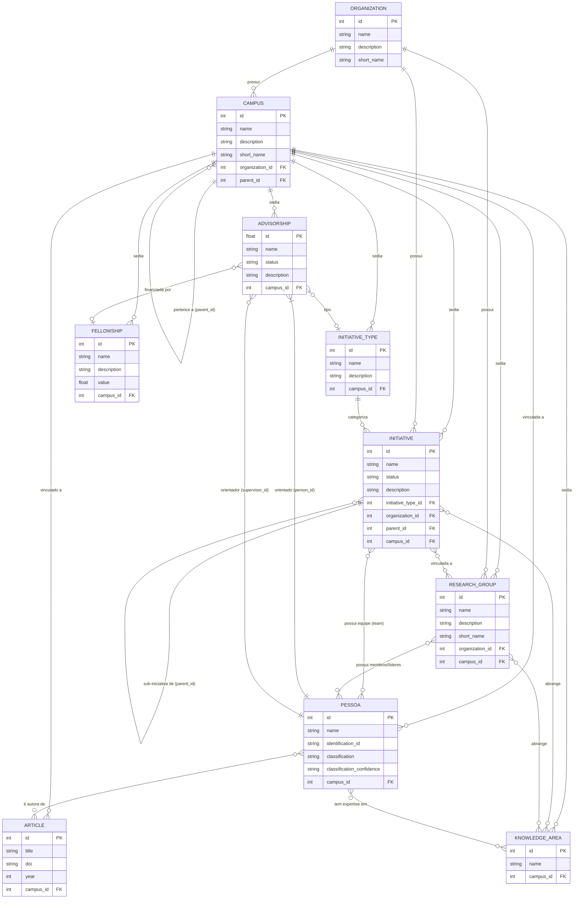

# Modelo Entidade-Relacionamento — Horizon

```mermaid
erDiagram
    %% Entidades Base
    CAMPUS {
        int id PK
        string name
        string description
        string short_name
        int organization_id FK
        int parent_id FK
    }

    ORGANIZATION {
        int id PK
        string name
        string description
        string short_name
    }

    INITIATIVE_TYPE {
        int id PK
        string name
        string description
        int campus_id FK
    }

    KNOWLEDGE_AREA {
        int id PK
        string name
        int campus_id FK
    }

    FELLOWSHIP {
        int id PK
        string name
        string description
        float value
        int campus_id FK
    }

    ARTICLE {
        int id PK
        string title
        string doi
        int year
        int campus_id FK
    }

    INITIATIVE {
        int id PK
        string name
        string status
        string description
        int initiative_type_id FK
        int organization_id FK
        int parent_id FK
        int campus_id FK
    }

    PESSOA {
        int id PK
        string name
        string identification_id
        string classification
        string classification_confidence
        int campus_id FK
    }

    RESEARCH_GROUP {
        int id PK
        string name
        string description
        string short_name
        int organization_id FK
        int campus_id FK
    }

    ADVISORSHIP {
        float id PK
        string name
        string status
        string description
        int campus_id FK
    }

    %% Relacionamentos
    ORGANIZATION ||--o{ CAMPUS : "possui"
    CAMPUS ||--o{ CAMPUS : "pertence a (parent_id)"

    CAMPUS ||--o{ INITIATIVE_TYPE : "sedia"
    CAMPUS ||--o{ KNOWLEDGE_AREA : "sedia"
    CAMPUS ||--o{ FELLOWSHIP : "sedia"
    CAMPUS ||--o{ ARTICLE : "vinculado a"
    CAMPUS ||--o{ INITIATIVE : "sedia"
    CAMPUS ||--o{ PESSOA : "vinculada a"
    CAMPUS ||--o{ RESEARCH_GROUP : "sedia"
    CAMPUS ||--o{ ADVISORSHIP : "sedia"

    ORGANIZATION ||--o{ INITIATIVE : "possui"
    ORGANIZATION ||--o{ RESEARCH_GROUP : "possui"

    INITIATIVE_TYPE ||--o{ INITIATIVE : "categoriza"

    INITIATIVE ||--o{ INITIATIVE : "sub-iniciativa de (parent_id)"
    INITIATIVE }o--o{ PESSOA : "possui equipe (team)"
    INITIATIVE }o--o{ KNOWLEDGE_AREA : "abrange"
    INITIATIVE }o--o{ RESEARCH_GROUP : "vinculada a"

    RESEARCH_GROUP }o--o{ PESSOA : "possui membros/líderes"
    RESEARCH_GROUP }o--o{ KNOWLEDGE_AREA : "abrange"

    PESSOA }o--o{ ARTICLE : "é autora de"
    PESSOA }o--o{ KNOWLEDGE_AREA : "tem expertise em"

    ADVISORSHIP }|--|| PESSOA : "orientado (person_id)"
    ADVISORSHIP }o--|| PESSOA : "orientador (supervisor_id)"
    ADVISORSHIP }o--o| FELLOWSHIP : "financiada por"
    ADVISORSHIP }o--o| INITIATIVE_TYPE : "tipo"
```
