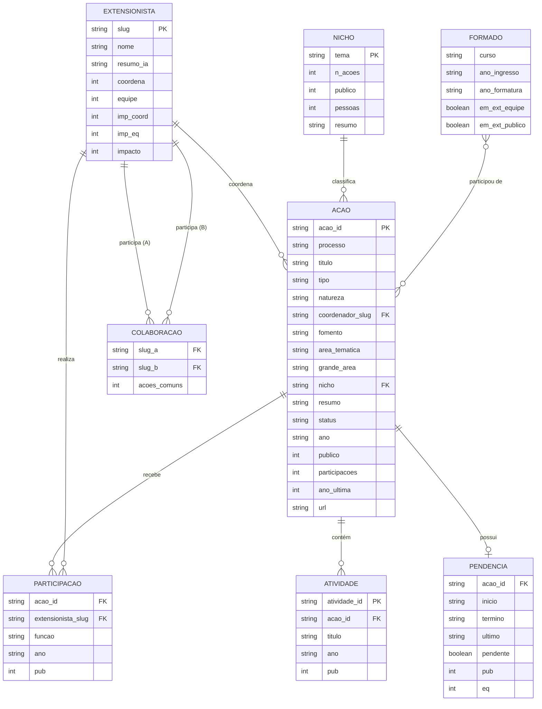

# Modelo Conceitual — SRC / Ifes Campus Serra

> Entidades e relacionamentos extraídos das bases públicas do Sistema de Registro e Certificados (SRC) do Ifes Campus Serra.
> Dados publicados em [ifesserra-lab.github.io/src](https://ifesserra-lab.github.io/src/) · 201 ações · 757 extensionistas · 525 atividades

---

## Diagrama ER

---

## Legenda

### Entidades

| Entidade | Descrição | Endpoint JSON |
|---|---|---|
| **ACAO** | Projeto, curso, evento ou programa de extensão/ensino registrado no SRC | `api/acoes/index.json` |
| **EXTENSIONISTA** | Pessoa com participação registrada — docente, aluno, colaborador ou convidado | `api/extensionistas/index.json` |
| **PARTICIPACAO** | Vínculo entre EXTENSIONISTA e ACAO, com função exercida e público impactado | Derivado de `api/extensionistas/<slug>.json` |
| **ATIVIDADE** | Subatividade de uma ACAO (tarefa, oficina, monitoria, evento pontual) | Derivado de `api/extensionistas/<slug>.json` |
| **NICHO** | Cluster temático derivado do título e resumo da ação (classificação automática) | `api/temas.json` |
| **COLABORACAO** | Par de EXTENSIONISTAs que trabalharam juntos em ao menos uma ação (grafo de co-autoria) | Derivado de `api/extensionistas/<slug>.json` |
| **PENDENCIA** | Status de relatório de uma ACAO: pendente, enviado ou nunca enviado | `api/pendencias-relatorio.json` |
| **FORMADO** | Aluno egresso com histórico cruzado com participação em extensão | `api/jornada.json` |

---

### Domínios dos atributos

#### `ACAO.tipo`
| Valor | Descrição |
|---|---|
| `Projeto` | Iniciativa contínua com equipe dedicada |
| `Curso` | Formação com carga horária e certificação |
| `Evento` | Ação pontual (palestra, seminário, competição) |
| `Programa` | Guarda-chuva que agrega múltiplas ações |
| `Programa em Rede` | Programa com participação multi-campus |

#### `ACAO.natureza`
| Valor |
|---|
| `Extensão` |
| `Ensino` |
| `Pesquisa` |
| `Desenv. Institucional` |

#### `ACAO.status`
| Valor | Critério |
|---|---|
| `ativa` | Última atividade >= 2024 |
| `intermediaria` | Última atividade entre 2022 e 2023 |
| `dormente` | Última atividade <= 2021 |

#### `ACAO.fomento`
`SEM VÍNCULO` · `PAEX-IFES` · `PRONATEC` · `MULHERES MIL` · `FAPES`

#### `PARTICIPACAO.funcao`
`COORDENADOR(A)` · `ALUNO(A) VOLUNTARIO` · `ALUNO(A) BOLSISTA` · `ALUNO(A) EM ATIVIDADE CURRICULAR` · `PROFESSOR(A)` · `COLABORADOR(A)` · `ORGANIZADOR(A)` · `INSTRUTOR(A)` · `MONITOR(A)` · `EXTENSIONISTA` · `ORIENTADOR(A)` · `SUPERVISOR(A)` · `MENTOR(A)` · `ASSESSOR(A)` · `CONSULTOR(A)` · `TUTOR(A)` · `PALESTRANTE` · `APOIO TÉCNICO` · `AUXILIAR TÉCNICO` · `MEMBRO DE COMITÊ GESTOR` · `PROFESSOR(A) VOLUNTÁRIO` · `COORDENADOR(A) ADJUNTO(A)`

#### `NICHO.tema`
`Robótica e cultura maker` · `Mulheres e inclusão` · `Captação e ingresso` · `Cultura e arte` · `Empreendedorismo e incubação` · `Saúde e bem-estar` · `Software, dados e sistemas` · `Ciência e divulgação` · `Escola e formação de professores` · `Idiomas` · `Outros / formação`

#### `ACAO.grande_area` (CNPq)
`Engenharias` · `Ciências Exatas e da Terra` · `Ciências Sociais Aplicadas` · `Ciências Humanas` · `Ciências da Saúde` · `Linguística, Letras e Artes`

#### `ACAO.area_tematica` (FORPROEX)
`Tecnologia e Produção` · `Educação` · `Cultura` · `Saúde` · `Trabalho` · `Direitos Humanos e Justiça`

---

## Notas de modelagem

**PARTICIPACAO** é uma entidade associativa (N:M) entre ACAO e EXTENSIONISTA. Um EXTENSIONISTA pode exercer múltiplas funções na mesma ACAO ao longo dos anos — cada combinação `(acao_id, slug, funcao, ano)` é um registro distinto.

**COLABORACAO** representa um grafo não-dirigido de co-participação: `(slug_a, slug_b, acoes_comuns)` é derivado automaticamente da sobreposição de PARTICIPACAOs entre dois extensionistas.

**FORMADO** é uma entidade derivada: cruzamento entre registros de alunos do sistema acadêmico e participações no SRC. Não possui chave primária explícita na API pública (dados anonimizados por curso/ano).

**Privacidade:** O público-alvo das ações aparece apenas como contagem agregada (`pub`, `publico`). Nunca são expostos nome, CPF ou e-mail de alunos. A equipe executora (EXTENSIONISTA) aparece como crédito público (nome + função + vínculo).
