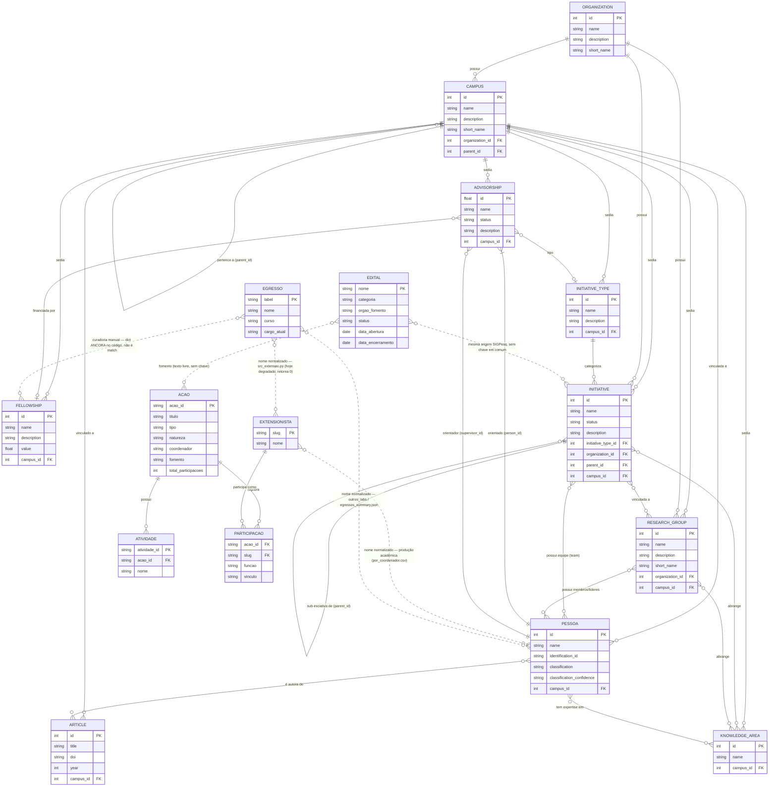

```mermaid
erDiagram
    %% ===================== HORIZON (pesquisa) =====================
    CAMPUS {
        int id PK
        string name
        string description
        string short_name
        int organization_id FK
        int parent_id FK
    }

    ORGANIZATION {
        int id PK
        string name
        string description
        string short_name
    }

    INITIATIVE_TYPE {
        int id PK
        string name
        string description
        int campus_id FK
    }

    KNOWLEDGE_AREA {
        int id PK
        string name
        int campus_id FK
    }

    FELLOWSHIP {
        int id PK
        string name
        string description
        float value
        int campus_id FK
    }

    ARTICLE {
        int id PK
        string title
        string doi
        int year
        int campus_id FK
    }

    INITIATIVE {
        int id PK
        string name
        string status
        string description
        int initiative_type_id FK
        int organization_id FK
        int parent_id FK
        int campus_id FK
    }

    PESSOA {
        int id PK
        string name
        string identification_id
        string classification
        string classification_confidence
        int campus_id FK
    }

    RESEARCH_GROUP {
        int id PK
        string name
        string description
        string short_name
        int organization_id FK
        int campus_id FK
    }

    ADVISORSHIP {
        float id PK
        string name
        string status
        string description
        int campus_id FK
    }

    %% ===================== SRC / DIRETORIA (extensão) =====================
    ACAO {
        string acao_id PK
        string titulo
        string tipo
        string natureza
        string coordenador
        string fomento
        int total_participacoes
    }

    ATIVIDADE {
        string atividade_id PK
        string acao_id FK
        string nome
    }

    EXTENSIONISTA {
        string slug PK
        string nome
    }

    PARTICIPACAO {
        string acao_id FK
        string slug FK
        string funcao
        string vinculo
    }

    %% ===================== EGRESSOS =====================
    EGRESSO {
        string label PK
        string nome
        string curso
        string cargo_atual
    }

    %% ===================== EDITAIS =====================
    EDITAL {
        string nome PK
        string categoria
        string orgao_fomento
        string status
        date data_abertura
        date data_encerramento
    }

    %% ===================== Relacionamentos — dentro de cada base (FK real) =====================
    ORGANIZATION ||--o{ CAMPUS : "possui"
    CAMPUS ||--o{ CAMPUS : "pertence a (parent_id)"
    CAMPUS ||--o{ INITIATIVE_TYPE : "sedia"
    CAMPUS ||--o{ KNOWLEDGE_AREA : "sedia"
    CAMPUS ||--o{ FELLOWSHIP : "sedia"
    CAMPUS ||--o{ ARTICLE : "vinculado a"
    CAMPUS ||--o{ INITIATIVE : "sedia"
    CAMPUS ||--o{ PESSOA : "vinculada a"
    CAMPUS ||--o{ RESEARCH_GROUP : "sedia"
    CAMPUS ||--o{ ADVISORSHIP : "sedia"
    ORGANIZATION ||--o{ INITIATIVE : "possui"
    ORGANIZATION ||--o{ RESEARCH_GROUP : "possui"
    INITIATIVE_TYPE ||--o{ INITIATIVE : "categoriza"
    INITIATIVE ||--o{ INITIATIVE : "sub-iniciativa de (parent_id)"
    INITIATIVE }o--o{ PESSOA : "possui equipe (team)"
    INITIATIVE }o--o{ KNOWLEDGE_AREA : "abrange"
    INITIATIVE }o--o{ RESEARCH_GROUP : "vinculada a"
    RESEARCH_GROUP }o--o{ PESSOA : "possui membros/líderes"
    RESEARCH_GROUP }o--o{ KNOWLEDGE_AREA : "abrange"
    PESSOA }o--o{ ARTICLE : "é autora de"
    PESSOA }o--o{ KNOWLEDGE_AREA : "tem expertise em"
    ADVISORSHIP }|--|| PESSOA : "orientado (person_id)"
    ADVISORSHIP }o--|| PESSOA : "orientador (supervisor_id)"
    ADVISORSHIP }o--o| FELLOWSHIP : "financiada por"
    ADVISORSHIP }o--o| INITIATIVE_TYPE : "tipo"

    ACAO ||--o{ ATIVIDADE : "possui"
    ACAO ||--o{ PARTICIPACAO : "registra"
    EXTENSIONISTA ||--o{ PARTICIPACAO : "participa como"

    %% ===================== Relacionamentos — entre bases (fraco, por nome — sem FK real) =====================
    EXTENSIONISTA }o..o{ PESSOA : "nome normalizado — produção acadêmica (por_coordenador.csv)"
    EGRESSO }o..o{ EXTENSIONISTA : "nome normalizado — src_extensao.py (hoje degradado, retorna 0)"
    EGRESSO }o..o{ PESSOA : "nome normalizado — outros_labs / egressos_summary.json"
    EGRESSO }o..o{ FELLOWSHIP : "curadoria manual — dict ANCORA no código, não é match"
    EDITAL }o..o{ ACAO : "fomento (texto livre, sem chave)"
    EDITAL }o..o{ INITIATIVE : "mesma origem SIGPesq, sem chave em comum"

```

    
