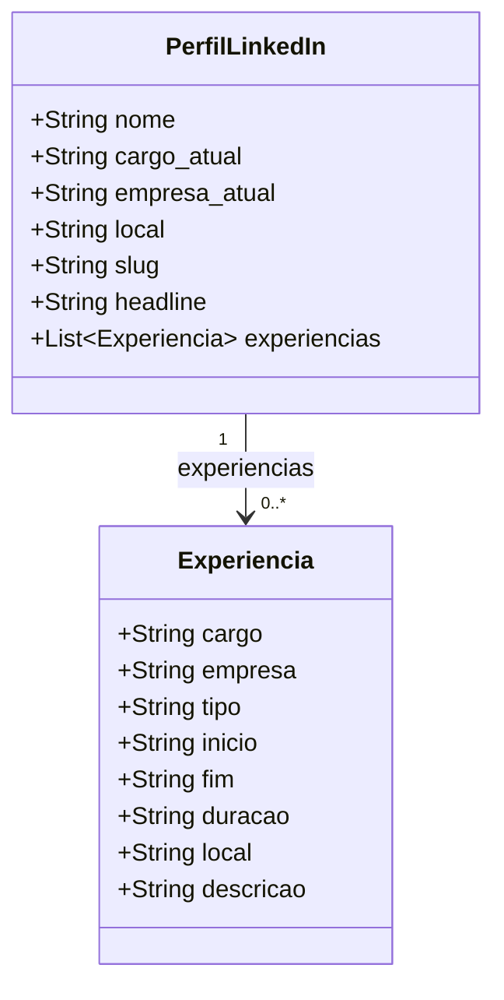

# Modelo de Dados — LinkedIn 
(dado bruto, como vem da fonte, estimado pelos pipelines públicos)

**Escopo:** Apenas os campos extraídos diretamente da página do LinkedIn pelo agente Mistral Large durante a coleta. Campos de controle adicionados pelos scripts (`confirmado`, `achado`, `curso`, etc.) e campos derivados pelo pipeline (`area`, `senioridade`, `anos_de_carreira`, etc.) estão fora deste modelo.

> **Evidência:** Os campos são reconstruídos a partir dos `.get()` e da docstring de `_vitrine_da_coleta` em `pipeline/gen_cursos.py` (linhas 85–115) e do comentário sobre `descricao` em `pipeline/gen_perfis.py` (linhas 40–43).

---

## 1. Diagrama de Classes

---

## 2. Dicionário de Atributos

### 2.1 `PerfilLinkedIn` — Cabeçalho do perfil

Campos lidos do topo da página do LinkedIn pelo agente de extração.

| Atributo | Tipo | Nulável? | Formato bruto | Evidência no código |
|---|---|---|---|---|
| `nome` | `str` | Não | Nome completo como escrito no LinkedIn. | `gen_cursos.py` L106: `p["nome"]`; L71: `p["nome"]` |
| `cargo_atual` | `str` | Sim | Cargo em destaque no topo do perfil, texto livre. | `gen_cursos.py` L108: `p.get("cargo_atual")`; L72 |
| `empresa_atual` | `str` | Sim | Empresa contratante atual, texto livre. | `gen_cursos.py` L109: `p.get("empresa_atual")`; L73 |
| `local` | `str` | Sim | Localidade declarada no perfil. Ex: `"Vitória, Espírito Santo, Brazil"`. | `gen_cursos.py` L110: `p.get("local")` |
| `slug` | `str` | Sim | Identificador da URL do perfil. Ex: `"in/fulano"` ou `"fulano"`. | `gen_cursos.py` L111: `p.get("slug")`; L78–82 (`_linkedin`) |
| `headline` | `str` | Sim | Texto livre de apresentação do perfil. **Descartado no pipeline — nunca publicado.** | `gen_cursos.py` L90 (docstring): `"headline NÃO sai (texto livre)"` |
| `experiencias` | `list[Experiencia]` | Sim | Lista de posições profissionais, na ordem em que aparecem no perfil. | `gen_cursos.py` L112: `p.get("experiencias")` |

---

### 2.2 `Experiencia` — Posição profissional

Cada item da seção de experiências do perfil, extraído pelo agente Mistral Large do HTML renderizado.

| Atributo | Tipo | Nulável? | Formato bruto | Evidência no código |
|---|---|---|---|---|
| `cargo` | `str` | Sim | Título do cargo como escrito na página. Pode conter sujeira de seletor HTML, ex: `"Software Engineer -> -"`. | `gen_cursos.py` L101 (docstring): *`"-\> -"` em 20 das 150 posições da primeira coleta*; L104: `JORNADA_PUBLICA` |
| `empresa` | `str` | Sim | Nome da empresa contratante, como escrito. | `gen_cursos.py` L104: `JORNADA_PUBLICA` |
| `tipo` | `str` | Sim | Modalidade de contrato, no idioma do perfil. Pode ser `"Full-time"`, `"Integral"`, `"Internship"`, `"Estágio"`. **Não normalizado.** | `gen_cursos.py` L102–103 (docstring): *"tipo passa como veio, `Integral` e `Full-time` seguem distintos"* |
| `inicio` | `str` | Sim | Data de início em inglês textual. Ex: `"Apr 2021"`, `"Jan 2018"`. | `gen_cursos.py` L98 (docstring): *"a passada grava o texto CRU da página (`\"Apr 2021\"`)"* |
| `fim` | `str` | Sim | Data de fim em inglês ou `"Present"` para vínculo ativo. Ex: `"Present"`, `"Oct 2023"`. | `gen_cursos.py` L98–99 (docstring): *`"Present"` → `fim: null` após normalização* |
| `duracao` | `str` | Sim | Duração textual em inglês. Ex: `"5 yrs 5 mos"`, `"10 mos"`. | `gen_cursos.py` L99 (docstring): *`"5 yrs 5 mos"` → normalizado para `"5 anos 5 meses"`* |
| `local` | `str` | Sim | Local de trabalho declarado. Ex: `"Vitória, Espírito Santo, Brazil"`, `"London · Remote"`. | `gen_cursos.py` L104: `JORNADA_PUBLICA` |
| `descricao` | `str` | Sim | Texto livre com descrição das atribuições da posição. **Descartado no pipeline — nunca publicado.** | `gen_perfis.py` L40–41: *"`descricao` fica de fora por ser texto livre — é onde uma frase solta sobre outra pessoa apareceria sem ninguém revisar"* |

