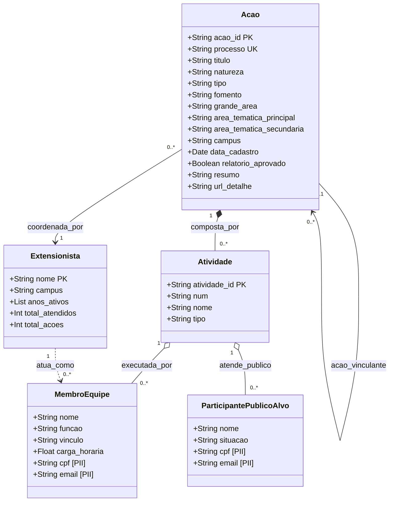
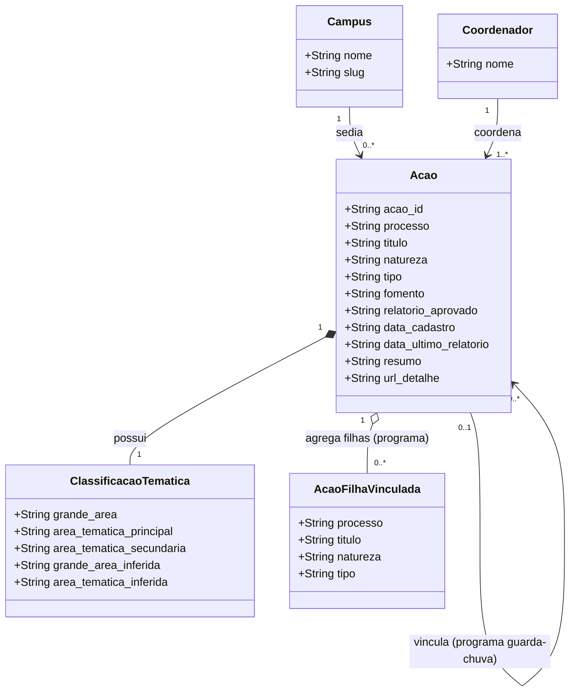

# Modelo de Dados — SRC/Ifes

> **Sistema:** SRC — Sistema de Registro e Emissão de Certificados do Ifes  
> **Fonte:** Portal público + extração autenticada · Extração real: 200 ações (Campus Serra)  
> **Repositório ETL:** [ifesserra-lab/src](https://github.com/ifesserra-lab/src)

---

## Diagrama de Classes

---

## Dicionário de Dados

> Atributos que aparecem em mais de uma entidade são agrupados em uma única linha, com a coluna **Entidade(s)** identificando cada origem.  
> **Obrigatório** indica se o campo sempre tem valor preenchido no SRC — `Sim` significa que o ETL sempre o extrai; `Não` significa que pode vir vazio.
> 
> **O que significa PII?**  
> **PII** é a sigla para *Personally Identifiable Information*, ou **Informação de Identificação Pessoal**. São dados sensíveis que identificam uma pessoa real no mundo físico. Neste sistema, dados marcados como **Sim** na coluna PII (como CPF, e-mail e nomes de alunos) são protegidos, não sendo publicados na API aberta do painel e mantidos apenas na extração restrita local.

| Atributo | Entidade(s) | Tipo | Obrigatório | PII | Significado | Valores possíveis | Exemplo |
|---|---|---|---|---|---|---|---|
| `acao_id` | Acao | String (PK) | Sim | Não | Identificador numérico interno gerado automaticamente pelo SRC para cada ação cadastrada | Inteiro sequencial como string | `"5961"` |
| `processo` | Acao | String (UK) | Sim | Não | Número oficial do processo administrativo no padrão SIPAC/MEC. É a chave que conecta dados públicos e autenticados no ETL | Formato `NNNNN.NNNNNN/AAAA-DD` | `"23158.000507/2026-12"` |
| `titulo` | Acao | String | Sim | Não | Nome completo da ação exatamente como cadastrado pelo coordenador no SRC | Texto livre | `"ASAS - Operador de Computador"` |
| `natureza` | Acao | Enum | Sim | Não | Categoria acadêmica da ação — define se é extensão, ensino, pesquisa ou desenvolvimento institucional | `Extensão` · `Ensino` · `Pesquisa` · `Desenv. Institucional` | `"Extensão"` |
| `tipo` | Acao, Atividade | String | Sim | Não | Em **Acao**: modalidade formal da ação (Enum fechado). Em **Atividade**: classificação interna da atividade, menos padronizada (texto livre) | **Acao:** `Curso` · `Projeto` · `Evento` · `Programa` · `Programa em Rede` · `Prestação de Serviço` · **Atividade:** Texto livre | `"Curso"` |
| `fomento` | Acao | Enum | Sim | Não | Fonte de financiamento da ação. Indica se recebeu verba de programa governamental ou se é executada sem financiamento externo | `SEM VÍNCULO` · `PAEX-IFES` · `PRONATEC` · `MULHERES MIL` · `FAPES` · `SETEC` | `"PAEX-IFES"` |
| `grande_area` | Acao | Enum | Não | Não | Grande área do conhecimento (tabela CNPq) à qual a ação se vincula. Frequentemente vazio em ações antigas — pode ser inferido por IA via `src-etl-enrich` | `Ciências Exatas e da Terra` · `Ciências Biológicas` · `Engenharias` · `Ciências da Saúde` · `Ciências Agrárias` · `Ciências Sociais Aplicadas` · `Ciências Humanas` · `Linguística, Letras e Artes` | `"Engenharias"` |
| `area_tematica_principal` | Acao | Enum | Não | Não | Área temática de extensão principal (tabela Forproex/MEC). Define o eixo de impacto social da ação. Pode ser inferida por IA quando vazia | `Comunicação` · `Cultura` · `Direitos Humanos e Justiça` · `Educação` · `Meio Ambiente` · `Saúde` · `Tecnologia e Produção` · `Trabalho` | `"Tecnologia e Produção"` |
| `area_tematica_secundaria` | Acao | Enum | Não | Não | Segunda área temática de extensão, usada quando a ação cobre dois eixos temáticos ao mesmo tempo. Mesmo conjunto de valores da principal | Mesmo Enum de `area_tematica_principal` | `"Trabalho"` |
| `campus` | Acao, Extensionista | String | Sim | Não | Campus do Ifes vinculado à ação ou ao extensionista. Em **Extensionista** é derivado das ações em que participou | Texto livre | `"Serra"` |
| `data_cadastro` | Acao | Date | Sim | Não | Data em que a ação foi formalmente cadastrada no SRC pelo coordenador. Permite análise histórica por ano | `DD/MM/AAAA` | `"18/03/2026"` |
| `relatorio_aprovado` | Acao | Boolean | Sim | Não | Indica se o relatório final da ação foi submetido e aprovado. Armazenado como texto no SRC, não como booleano real | `"Sim"` · `"Não"` | `"Sim"` |
| `resumo` | Acao | String | Não | Não | Texto descritivo da ação escrito pelo coordenador. Descreve objetivos, metodologia e público. Usado pelo `src-etl-enrich` como entrada para classificação por IA | Texto livre longo | `"O Curso de Formação Inicial e Continuada (FIC)..."` |
| `url_detalhe` | Acao | String | Sim | Não | URL da página de detalhes da ação no portal público do SRC. Usada pelo ETL (`detail.py`) para buscar dados aprofundados via HTTPX | `https://src.ifes.edu.br/src/public/detalha-acao.xhtml?acao=<id>&pfdlgcid=<uuid>` | `"https://src.ifes.edu.br/.../detalha-acao.xhtml?acao=5961"` |
| `atividade_id` | Atividade | String (PK) | Sim | Não | Identificador numérico interno gerado automaticamente pelo SRC para cada atividade dentro de uma ação | Inteiro sequencial como string | `"1247"` |
| `num` | Atividade | String | Sim | Não | Número sequencial da atividade dentro da ação, exibido na interface do SRC. Serve para ordenação e identificação visual | Inteiro como string | `"1"` · `"2"` |
| `nome` | Atividade, MembroEquipe, ParticipantePublicoAlvo, Extensionista | String | Sim | Apenas em **ParticipantePublicoAlvo** | Nome descritivo ou nome completo da pessoa, conforme a entidade. Em **Atividade**: nome da atividade (público). Em **MembroEquipe**: crédito público, publicado. Em **ParticipantePublicoAlvo**: dado de identificação pessoal, nunca publicado. Em **Extensionista**: chave de identificação derivada | Texto livre | `"Turma 1"` · `"Felipe Frechiani de Oliveira"` · *(restrito em participante)* |
| `funcao` | MembroEquipe | Enum | Sim | Não | Papel desempenhado pelo membro na execução da atividade | `COORDENADOR(A)` · `PROFESSOR(A)` · `COLABORADOR(A)` · `PALESTRANTE` · `ORGANIZADOR(A)` · `ALUNO(A) BOLSISTA` · `ALUNO(A) VOLUNTARIO` · `ALUNO(A) EM ATIVIDADE CURRICULAR` | `"ALUNO(A) BOLSISTA"` |
| `vinculo` | MembroEquipe | String | Sim | Não | Vínculo institucional do membro com o Ifes — diferencia servidores efetivos, alunos e participantes externos à instituição | Texto livre | `"Servidor"` · `"Bolsista"` · `"Externo"` |
| `carga_horaria` | MembroEquipe | Float | Não | Não | Quantidade de horas dedicadas pelo membro à atividade. Registrada para fins de comprovante e relatório institucional | Número decimal | `40.0` |
| `cpf` | MembroEquipe, ParticipantePublicoAlvo | String | Não | **Sim** | CPF da pessoa. Coletado apenas na extração autenticada (`src-etl-part`). Usado para emissão de certificados. Nunca publicado na API pública | Formato `NNN.NNN.NNN-DD` | *(restrito)* |
| `email` | MembroEquipe, ParticipantePublicoAlvo | String | Não | **Sim** | E-mail da pessoa. Coletado apenas na extração autenticada. Usado para comunicação e envio de certificados. Nunca publicado na API pública | Formato e-mail padrão | *(restrito)* |
| `situacao` | ParticipantePublicoAlvo | Enum | Sim | Não | Status atual do participante em relação à atividade — se concluiu com aprovação, ainda está cursando ou foi reprovado | `APROVADO` · `CURSANDO` · `REPROVADO` | `"APROVADO"` |
| `anos_ativos` | Extensionista | List[String] | Sim | Não | Lista dos anos em que o extensionista coordenou ou integrou equipe de ao menos uma ação. Derivado de `data_cadastro` das ações relacionadas | Lista de strings de ano | `["2018", "2019", "2022"]` |
| `total_atendidos` | Extensionista | Integer | Sim | Não | Soma total de pessoas atendidas em todas as atividades das ações coordenadas ou integradas pelo extensionista. Derivado da contagem de `ParticipantePublicoAlvo` | Inteiro ≥ 0 | `247` |
| `total_acoes` | Extensionista | Integer | Sim | Não | Quantidade de ações em que o extensionista figura como coordenador responsável. Derivado da contagem em `Acao.coordenador` | Inteiro ≥ 1 | `9` |

## Diagrama de Classes ( COM OS DADOS PUBLICOS )

# Dicionário de Dados Publicos 

Este documento descreve os metadados e atributos das ações de extensão e ensino extraídos publicamente do **SRC/Ifes** (Sistema de Registro e Emissão de Certificados), sem a necessidade de autenticação ou credenciais de administrador.

---

## 1. Entidade Principal: `Ação`

Dados extraídos da consulta pública (`consulta-acao.xhtml`) e da ficha detalhada de cada ação (`detalha-acao.xhtml`).

| Campo (Atributo) | Rótulo no SRC | Tipo de Dado | Obrigatório? | Descrição | Exemplo de Valor |
| :--- | :--- | :--- | :---: | :--- | :--- |
| **`acao_id`** | *(Parâmetro `?acao=`)* | Texto / Numérico | Sim | Identificador primário interno da ação no SRC. | `"5646"` |
| **`processo`** | `Processo nº` | Texto | Sim | Número do processo administrativo formal no protocolo/SIPAC do Ifes. | `"23158.001712/2024-14"` |
| **`titulo`** | `Título ação` | Texto | Sim | Nome oficial do projeto, curso, evento ou programa. | `"Fábrica de Ideias - Robótica Educacional"` |
| **`natureza`** | `Natureza` | Texto (Enum) | Sim | Finalidade acadêmica institucional da ação. | `"Extensão"` ou `"Ensino"` |
| **`tipo`** | `Tipo ação` | Texto (Enum) | Sim | Modalidade/formato da ação conforme regulamento institucional. | `"Projeto"`, `"Curso"`, `"Evento"`, `"Programa"` |
| **`coordenador`** | `Coordenador(a)` | Texto | Sim | Nome completo do servidor (docente ou TAE) responsável pela coordenação. | `"João da Silva"` |
| **`campus`** | *(Dropdown)* | Texto | Sim | Campus do Ifes onde a ação é sediada e executada. | `"Serra"`, `"Vitória"`, `"Vila Velha"` |
| **`fomento`** | `Fomento` | Texto (Enum) | Não | Origem e status de recursos financeiros da ação. | `"Sem fomento"`, `"Com fomento interno"`, `"Com fomento externo"` |
| **`acao_vinculante`** | `Ação vinculante` | Texto | Não | Nome do programa guarda-chuva ao qual este projeto/curso está vinculado. | `"PROGRAMA LAMPEX"` |
| **`grande_area`** | `Grande área conhecimento` | Texto (CNPq) | Não | Macroárea do conhecimento conforme árvore oficial da CAPES/CNPq. | `"Ciências Exatas e da Terra"`, `"Engenharias"` |
| **`area_tematica_principal`** | `Área temática principal` | Texto (FORPROEX) | Não | Linha temática de extensão universitária nacional. | `"Tecnologia e Produção"`, `"Educação"` |
| **`area_tematica_secundaria`** | `Área temática secundária` | Texto (FORPROEX) | Não | Linha temática complementar (se informada). | `"Trabalho"`, `"Comunicação"` |
| **`relatorio_aprovado`** | `Relatório aprovado` | Texto (Booleano) | Não | Indica se o relatório final de prestação de contas/atividades foi aprovado. | `"Sim"`, `"Não"`, ou vazio (em andamento) |
| **`data_cadastro`** | `Data de cadastro` | Data (`DD/MM/AAAA`) | Não | Data de submissão/registro da ação no SRC. | `"15/03/2023"` |
| **`data_ultimo_relatorio`** | `Data último relatório` | Data (`DD/MM/AAAA`) | Não | Data em que o último relatório de acompanhamento foi submetido. | `"10/12/2023"` |
| **`resumo`** | `Resumo` | Texto longo | Não | Descrição detalhada dos objetivos, justificativa e metodologia da ação. | `"O projeto visa capacitar estudantes..."` |
| **`url_detalhe`** | *(Gerado)* | URL | Sim | Link web direto para visualização da ficha no portal público. | `https://src.ifes.edu.br/src/public/detalha-acao.xhtml?acao=5646` |

---

## 2. Entidade: `Ação Filha Vinculada` (Sub-ações de um Programa)

Quando uma ação possui o tipo **"Programa"**, ela pode agregar ações filhas públicas listadas em `consulta-acao-vinculada.xhtml?acao_vinculante=<acao_id>`.

| Campo | Tipo de Dado | Descrição | Exemplo de Valor |
| :--- | :--- | :--- | :--- |
| **`processo`** | Texto | Número do processo da ação filha vinculada. | `"23158.002130/2024-51"` |
| **`titulo`** | Texto | Título da ação filha vinculada. | `"Oficina de Introdução a Arduino"` |
| **`natureza`** | Texto | Natureza da ação filha (`Extensão` ou `Ensino`). | `"Extensão"` |
| **`tipo`** | Texto | Modalidade da ação filha (`Projeto`, `Curso`, etc.). | `"Curso"` |

---

## 3. Campos Opcionais de Enriquecimento por IA (`src-etl-enrich`)

Campos adicionados não-destrutivamente via chamada à API do Mistral AI quando as áreas originais do SRC estão vazias:

| Campo | Tipo de Dado | Descrição | Exemplo de Valor |
| :--- | :--- | :--- | :--- |
| **`grande_area_inferida`** | Texto | Grande Área CNPq deduzida a partir do Título e Resumo. | `"Engenharias"` |
| **`area_tematica_inferida`** | Texto | Área temática FORPROEX deduzida a partir do Título e Resumo. | `"Tecnologia e Produção"` |
| **`_inferencia`** | Objeto JSON | Metadados do preenchimento: modelo de linguagem, score de confiança e data. | `{"modelo": "mistral-small-latest", "confianca": 0.92}` |

---
