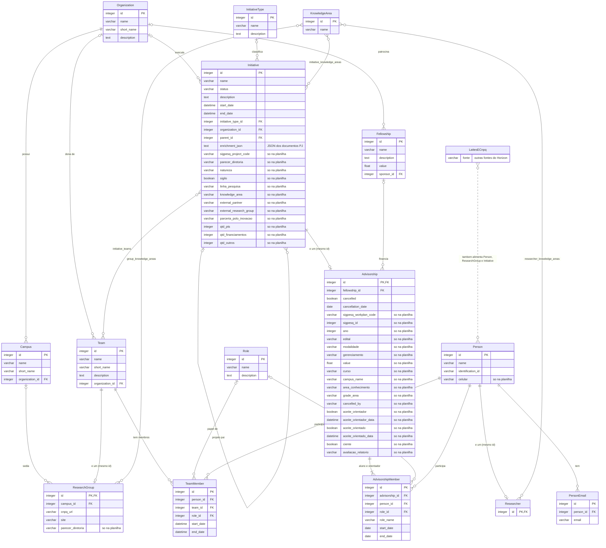

# Diagrama ER – Fonte SigPesq (Horizon ETL)

Tabelas, tipos, PKs e FKs conforme o schema do banco do Horizon (`db/horizon.db`, gerado pelo ETL `ifesserra-lab/horizon_etl`, commit `b45ac2f`). Atributos marcados `so na planilha` existem no SigPesq, mas o ETL não grava. O significado de cada tabela e atributo está no dicionário (`Dicionario_SigPesq.xlsx`).

**Legenda**

| Ponta da linha | Significado |
| --- | --- |
| dois traços | exatamente um |
| círculo + traço | zero ou um |
| traço + pé de galinha | um ou vários |
| círculo + pé de galinha | zero ou vários |

Linha cheia: chave estrangeira no banco. Linha tracejada: outras fontes do Horizon (Lattes e CNPq). Linhas com nome de tabela (`initiative_teams`, `*_knowledge_areas`) são tabelas de ligação N:N. "e um (mesmo id)" indica herança: a tabela usa o mesmo id da outra.
