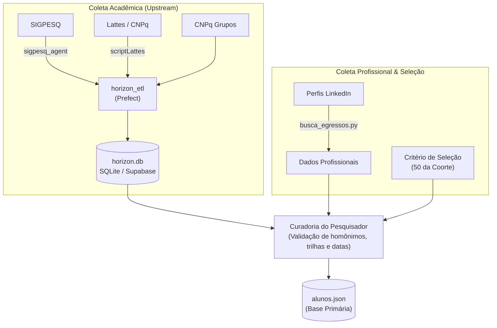
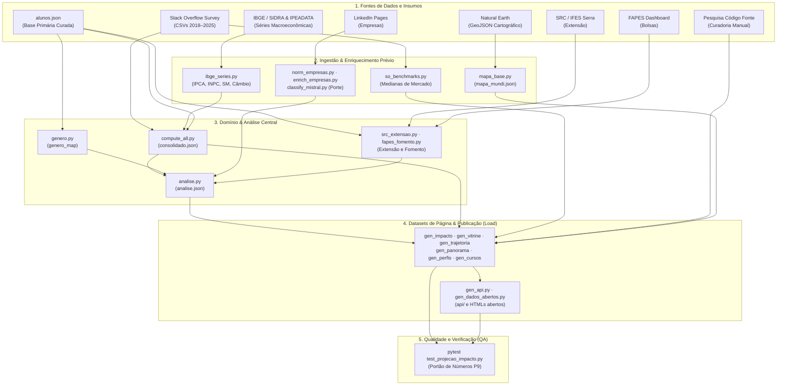

# ETL e Fontes de Dados — Base de Egressos
> **Repositório Principal:** https://github.com/ifesserra-lab/egressos  
> **Base de Estudo:** 50 egressos de TI do IFES Campus Serra (coorte anonimizada A–AX)  
> **Data de Atualização:** 17/09/2026

---

## 1. Fontes de Dados de Origem Mapeadas

O estudo consome dados de fontes públicas, governamentais, institucionais e bases curadas:

| # | Fonte de Dados | URL / Origem | Tipo de Acesso | Ferramenta / Consumidor | Dados Extraídos / Papel |
|---|---|---|---|---|---|
| 1 | **Base Primária Curada (`alunos.json`)** | Local / Repositório privado com PII | Arquivo local | `compute_all.py`, `gen_*.py` | Dados biográficos dos 50 egressos: trajetória profissional, bolsas, datas e trilhas. |
| 2 | **Stack Overflow Developer Survey** | [survey.stackoverflow.co](https://survey.stackoverflow.co) | CSVs públicos (2018–2025, ~150–200 MB/ed) | `so_benchmarks.py`, `compute_all.py` | Distribuição salarial de desenvolvedores no Brasil e no mundo. Edição de mercado de referência: **2023**. |
| 3 | **IBGE / SIDRA (IPCA)** | [Tabela 1737, Variável 2266](https://apisidra.ibge.gov.br/values/t/1737/n1/all/v/2266/p/all) | API REST pública (sem autenticação) | `ibge_series.py` | Número-índice mensal de inflação oficial para deflacionar séries salariais para R$ de 2026. |
| 4 | **IBGE / SIDRA (INPC)** | [Tabela 1736, Variável 2289](https://apisidra.ibge.gov.br/values/t/1736/n1/all/v/2289/p/all) | API REST pública (sem autenticação) | `ibge_series.py` | Inflação das famílias de menor renda; base do cálculo do ganho real do salário mínimo. |
| 5 | **IPEADATA (Salário Mínimo)** | [Série MTE12_SALMIN12](http://www.ipeadata.gov.br/api/odata4/ValoresSerie\(SERCODIGO='MTE12_SALMIN12'\)) | API OData REST pública | `ibge_series.py` | Histórico mensal do salário mínimo nominal para cálculo da trajetória em múltiplos de SM. |
| 6 | **IPEADATA (Câmbio USD/BRL)** | [Série BM12_ERV12](http://www.ipeadata.gov.br/api/odata4/ValoresSerie\(SERCODIGO='BM12_ERV12'\)) | API OData REST pública | `ibge_series.py` | Taxas mensais de câmbio comercial para conversão dos salários em dólares do SO Survey. |
| 7 | **LinkedIn Company Pages** | [LinkedIn Search](https://www.linkedin.com) | Scraping autenticado via `browser-use` + Chrome | `enrich_empresas.py`, `resolve_company_urls.py` | Metadados das empresas empregadoras: headcount, sede, setor, porte e especialidades. |
| 8 | **FAPES Dashboard** | Portal institucional FAPES | Exportação JSON interna | `fapes_fomento.py` | Alocação de bolsas e vínculo a projetos de fomento (destaque aos projetos âncora 34552 e 39212). |
| 9 | **SRC / IFES Serra (Extensão)** | [ifesserra-lab/src](https://github.com/ifesserra-lab/src) | Repositório satélite / scraping Playwright | `src_extensao.py` | Participação de egressos em ações e equipes de extensão do IFES registradas no SRC. |
| 10 | **SIGPESQ (Pesquisa IFES)** | [ifesserra-lab/sigpesq_agent](https://github.com/ifesserra-lab/sigpesq_agent) | Agent automatizado (portal SigPesq) | `horizon_etl` → `alunos.json` | Planos de trabalho, bolsas de IC e projetos de pesquisa do campus. |
| 11 | **Currículo Lattes (CNPq)** | [ifesserra-lab/scriptLattes](https://github.com/ifesserra-lab/scriptLattes) | Selenium/ChromeDriver | `horizon_etl` → `alunos.json` | Produção acadêmica, formações e histórico registrado no CNPq. |
| 12 | **Pesquisa Código Fonte** | Dados da pesquisa salarial nacional | Manual / Curado pelo pesquisador | `gen_trajetoria.py`, `gen_api.py` | Balizador salarial do mercado brasileiro de TI (médias CLT × PJ por senioridade). |
| 13 | **Natural Earth (Geometrias)** | Cartografia de domínio público | GeoJSON público | `mapa_base.py` | Polígonos simplificados em SVG para visualização de internacionalização. |

---

## 2. Construção da Base Primária (`alunos.json`)

O arquivo `alunos.json` é a **fonte primária** do estudo e **não é versionado publicamente** por conter PII (*Personally Identifiable Information*). 

Diferente do pipeline de publicação (que roda de ponta a ponta automaticamente), a construção do `alunos.json` resulta de **coleta semi-automatizada com curadoria humana do pesquisador**:

1. **Identificação da Coorte:** Seleção não aleatória de 50 egressos de TI do IFES Serra que vivenciaram a tríade formativa (monitoria/ensino, iniciação científica/pesquisa aplicada e extensão em laboratórios como o LEDS).
2. **Ingestão Acadêmica (Horizon ETL):** O `horizon_etl` orquestra via Prefect o download de dados do SigPesq (`sigpesq_agent`) e do Lattes (`scriptLattes`), consolidando-os em `horizon.db`.
3. **Ingestão Profissional:** Coleta dos dados profissionais públicos via LinkedIn com o script privado `busca_egressos.py`.
4. **Síntese Curada:** O pesquisador cruza as fontes, resolve homônimos (a base acadêmica não possui CPF), completa lacunas e salva a estrutura final em `alunos.json`.

---

## 3. Complementaridade: FAPES Dashboard vs. SRC-ETL

Uma distinção central no pipeline é a divisão de papéis entre as fontes institucionais:

* **`fapes_fomento.py` (Fonte: Portal FAPES):** Captura bolsas concedidas pela agência de fomento estadual (FAPES/PRODEST), com foco em projetos estruturantes (ex.: 34552 - ES na Palma da Mão, 39212 - Acesso Cidadão).
* **`src_extensao.py` (Fonte: Sistema SRC do IFES):** Mapeia o histórico institucional de extensão no IFES (cursos, projetos, eventos), identificando quem atuou como membro de equipe ou bolsista de extensão, independentemente de ter recebido fomento FAPES.

> **Degradação Graciosa:** O arquivo `src_extensao.py` verifica a existência do diretório configurado via `EGRESSOS_SRC_ETL`. Se ausente, o pipeline emite um aviso no terminal e conclui a execução sem quebrar, deixando a contagem de extensão zerada.

---

## 4. Catálogo Completo de Scripts ETL

### 4.1. Orquestrador

| Script (`pipeline/`) | Descrição e Papel no Pipeline | Saídas / Artefatos Principais |
|---|---|---|
| `build_report.py` | Coordena o build completo em 5 passos determinísticos: Ingestão de insumos → Cruzamento de domínio → Carga de datasets → Portão de PII → Testes automatizados. | Orquestração geral do build |

### 4.2. Extração (Extract)

| Script (`pipeline/`) | Descrição e Papel no Pipeline | Saídas / Artefatos Principais |
|---|---|---|
| `ibge_series.py` | Puxa séries mensais de IPCA, INPC, Salário Mínimo e Câmbio de APIs públicas (SIDRA/IBGE e IPEADATA). | `ibge_series.json` `salario_minimo.json` |
| `so_benchmarks.py` | Processa CSVs da Stack Overflow (2018–2025) e calcula medianas salariais por cargo e experiência. | `so_benchmarks.json` `cargos_ao_longo_do_tempo.json` |
| `compute_all.py` | Núcleo do cálculo salarial: cruza a trajetória de `alunos.json` com benchmarks SO Survey e deflaciona via IPCA. | `consolidado.json` |
| `enrich_empresas.py` | Scraping de Company Pages do LinkedIn via Chrome automatizado (`browser-use`): headcount, sede e setor. | `empresas_linkedin_data.json` `empresas_porte.json` |
| `resolve_company_urls.py` | Valida e resolve URLs e slugs canônicos das empresas no LinkedIn. | `empresas_linkedin_urls.json` |
| `fapes_fomento.py` | Extrai bolsas e projetos FAPES/PRODEST que financiaram egressos (projetos âncora 34552 e 39212). | `fapes_fomento.json` |
| `src_extensao.py` | Cruza participantes de ações de extensão do SRC/IFES com os egressos do estudo. | Insumo para `analise.json` |

### 4.3. Transformação (Transform)

| Script (`pipeline/`) | Descrição e Papel no Pipeline | Saídas / Artefatos Principais |
|---|---|---|
| `analise.py` | Gera análises estatísticas: clusterização KMeans, fluxos Sankey de carreira, gênero e impacto de extensão. | `analise.json` |
| `norm_empresas.py` | Normaliza e agrupa variantes de nomes de empresas para deduplicação cadastral. | `empresas_aliases.json` |
| `classify_empresas.py` | Classifica empresas empregadoras por tipo, segmento e origem de capital. | Insumo cadastral |
| `classify_mistral.py` `mistral_porte.py` | Classifica porte e setor econômico das empresas via API da LLM Mistral. | Insumo para `empresas_porte.json` |
| `genero.py` | Infere e agrega distribuição de gênero da coorte com base nos prenomes. | Insumo para `analise.json` |
| `mapa_base.py` | Converte geometrias do Natural Earth em SVG equirretangular para o mapa múndi. | `mapa_mundi.json` |

### 4.4. Carga e Datasets de Página (Load)

| Script (`pipeline/`) | Descrição e Papel no Pipeline | Saídas / Artefatos Principais |
|---|---|---|
| `gen_impacto.py` | Consolida indicadores de impacto e crescimento para a página inicial. | `impacto.json` |
| `gen_vitrine.py` | Gera vitrine pública com perfis nominais (garantindo **ausência total de dados de renda**). | `vitrine.json` |
| `gen_trajetoria.py` | Compila séries de evolução salarial e réguas de senioridade/países. | `trajetoria.json` |
| `gen_panorama.py` | Gera cards individuais anonimizados da coorte (A–AX) para o dashboard. | `panorama.json` |
| `gen_perfis.py` | Gera datasets dissociados de perfis cadastrais e faixas de renda de mercado. | `egressos_perfil.json` `renda_por_senioridade.json` |
| `gen_cursos.py` | Segmenta os dados e comparativos específicos entre os cursos BSI e ECA. | `recorte_cursos.json` |
| `gen_api.py` | Exporta e empacota os endpoints JSON estáticos servidos no GitHub Pages. | Endpoints em `api/*.json` |
| `gen_dados_abertos.py` | Constrói a página HTML de download de datasets abertos. | `dados-abertos.html` |
| `gen_nav.py` | Injeta componente de navegação compartilhado nas páginas HTML. | Componente de UI |
| `gen_reguas.py` `gen_executivo.py` | Scripts legados para geração e injeção de dados em HTMLs legados via regex. | `trajetoria_salarial.html` `dashboard_executivo.html` |

### 4.5. Garantia da Qualidade (QA)

| Script (`pipeline/`) | Descrição e Papel no Pipeline | Saídas / Artefatos Principais |
|---|---|---|
| `qa_report.py` | Audita integridade e consistência cruzada entre todos os JSONs gerados. | Relatório de QA |
| `test_projecao_impacto.py` | Suíte `pytest` que confere cada número publicado contra os dados de origem calculados. | Portão de testes |

---

## 5. Fluxo Geral do Pipeline

---

## 6. Decisões Metodológicas e Regras de Negócio

1. **Stack Overflow Survey 2023 como Referência:**
   * *Exclusão de 2025:* A edição removeu a coluna `YearsCodePro`, inviabilizando o pareamento por anos de experiência no modelo.
   * *Exclusão de 2024:* A subamostra brasileira caiu de 852 para 474 respondentes, gerando distorções estatísticas espúrias na curva salarial.
2. **Separação Estrita de PII e Dados de Remuneração:**
   * Nenhuma página ou dataset público associa simultaneamente **nome da pessoa** e **renda estimada**.
   * `egressos_perfil.json` contém nomes e cargos públicos, sem menção a renda.
   * `consolidado.json` e `panorama.json` contêm faixas salariais, porém identificados exclusivamente por rótulos opacos (A a AX).
   * O portão de publicação do `build_report.py` bloqueia automaticamente o deploy caso encontre nomes da base nos datasets públicos.
3. **Normalização de Empresas:**
   * Os empregadores são unificados deterministicamente através de `norm_empresas.py` e validados pelo catálogo de aliases em `empresas_aliases.json`.
