# **Guia Lattes (parte Horizon / Lattes)**

---

## **1\. Fontes de Dados**

Conforme o mapeamento focado no perfil acadêmico e produção dos pesquisadores, a fonte de origem está listada abaixo:

* **Plataforma Lattes (CNPq)**  
  * **URL Base:** `[http://lattes.cnpq.br/](http://lattes.cnpq.br/)` (Busca e extração)  
  * **Tipo de Acesso:** Público (não autenticado).  
  * **Formato de Origem:** Páginas web (HTML bruto).

A Plataforma Lattes resolve exclusivamente o perfil acadêmico e o histórico de publicações. 

---

## **2\. Resumo das Etapas do Pipeline (ETL)**

**A. Extração e Gerenciamento de Cache**

* **Ação:** O `scriptLattes` atua como o motor de busca e download. Ele acessa a Plataforma Lattes e faz o download da página inteira do currículo de cada pesquisador listado.  
* **Armazenamento Bruto:** Esse arquivo HTML completo é salvo localmente em uma pasta chamada `cache/`.  
* **Comportamento do Cache:** Para economizar tempo de execução e banda, o sistema é otimizado ("preguiçoso"). Se ele encontrar o HTML do pesquisador já salvo no `cache/`, o script reutiliza esse arquivo e pula o download.  
* Para extrair dados atualizados (evitando dados obsoletos no dashboard), é estritamente necessário apagar/limpar a pasta `cache/` para forçar o script a baixar a versão mais recente do portal do CNPq.

### **B. Transformação (Parser)**

* **Ação:** Um script de parsing lê os arquivos HTML brutos armazenados no cache e extrai os metadados relevantes, convertendo-os em um modelo estruturado e legível por máquina.  
* **Consolidação:** O resultado é um arquivo estruturado no formato **JSON**, sendo gerado um arquivo individual e exclusivo para cada pesquisador.  
* **Anatomia do JSON Canônico:**  
  * **Textos Únicos (Strings):** Utilizados para informações singulares e diretas. Por exemplo, o `nome_completo` é extraído em uma única string (sem separar nome e sobrenome), e o `id_lattes` é extraído como um texto fixo de 16 dígitos numéricos.  
  * **Listas (Arrays):** Utilizadas para entidades que se repetem no currículo.  
    * *Exemplo 1 (Formação):* O nó `formacao_academica` agrupa as diversas formações (ensino médio, superior, etc.), dividindo internamente o nome da instituição, ano de início e ano de conclusão.  
    * *Exemplo 2 (Idiomas):* O nó `idiomas` traz um detalhamento granular das habilidades, avaliando níveis específicos de compreensão, fala, leitura e escrita para cada idioma cadastrado.

  ### **C. Carga e Exports** 

* Os JSONs intermediários formam o modelo canônico que alimenta as rotinas de consolidação final e a geração dos arquivos de exportação que o painel do Horizon consome para renderizar os gráficos e indicadores.

---

## **3\. O que vem no JSON (dicionário)**

| Bloco | Campos |
| ----- | ----- |
| `informacoes_pessoais` | id\_lattes, nome\_completo, nome\_citacoes, sexo, rotulo, periodo, bolsa\_produtividade, endereco\_profissional, atualizacao\_cv, url, texto\_resumo |
| `formacao_academica` | tipo, nome\_instituicao, ano\_inicio, ano\_conclusao, descricao |
| `atuacao_profissional` | instituicao, instituicao\_nome/sigla/pais, periodo, ano\_inicio, ano\_fim, vinculo, enquadramento, regime, cargo\_funcao, tipo (+ disciplinas, linhas\_pesquisa, atividades) |
| `projetos_pesquisa` · `projetos_extensao` · `projetos_desenvolvimento` | nome, ano\_inicio, ano\_conclusao, descricao, tipo, integrantes\[{nome, papel}\], financiadores\[{nome, tipo\_apoio}\] |
| `areas_de_atuacao` | grande\_area, area, subarea, especialidade, descricao\_completa |
| `idiomas` · `premios_titulos` · `linhas_de_pesquisa` | nome/proficiências · descricao/ano · linhas |
| `producao_bibliografica` | artigos\_periodicos (titulo, ano, autores, revista, volume, numero, paginas, issn, **doi**, qualis), livros\_publicados, capitulos\_livros, trabalhos\_completos\_congressos, resumos\_expandidos, resumos\_congressos, artigos\_aceitos, apresentacoes\_trabalhos, textos\_jornais, outras\_producoes |
| `producao_tecnica` · `patentes_registros` · `producao_artistica` | softwares, produtos, processos, trabalhos técnicos, entrevistas · patentes, programas, desenhos industriais · produção artística |
| `orientacoes` | `em_andamento` e `concluidas` × {pos\_doutorado, doutorado, mestrado, especializacao, tcc, **iniciacao\_cientifica**, outros}: titulo, ano\_inicio, (ano\_conclusao), **orientando**, tipo\_trabalho, instituicao, curso |
| `eventos` · `bancas` | participações/organizações · mestrado, doutorado, qualificações, graduação, outras |
| `estatisticas` | totais de artigos, livros, capítulos, congressos, projetos (3 tipos), orientações |

* `autores` e `orientando` são texto (nome), não ID → cruzar com outras bases só por nome.  
* `estatisticas.total_orientacoes_*` só soma pós-doutorado, doutorado, mestrado e IC. TCC, especialização e "outros" ficam de fora do total (mas aparecem na lista).  
* Campos vazios saem como `null`/vazio; ausência de `financiadores` pode ser "não informado no Lattes" e não "não tem".

---

              
**4\. Ficha de anotação** 

| Dado | Seção no Lattes (HTML) | Campo no JSON | Vem sempre? | Serve ao oráculo? |
| ----- | ----- | ----- | ----- | ----- |
| ID Lattes | cabeçalho | `informacoes_pessoais.id_lattes` | Sim | chave de ligação |
| Nome | cabeçalho | `nome_completo` | Sim | chave por nome/ principal de busca |
| Financiador | projetos | `projetos_*.financiadores` | Sim | análise de fomento |
| Orientando (IC) | orientações | `orientacoes.*.iniciacao_cientifica` | Sim | bolsistas/estudantes |

## Modelo de Dados - scriptLattes

```mermaid
classDiagram
    direction TB

    class Pesquisador {
        String idLattes
        String nomeCompleto
        String nomeCitacoes
        String sexo
        String rotulo
        String periodo
        String bolsaProdutividade
        String enderecoProfissional
        Date atualizacaoCv
        String url
        String textoResumo
    }

    %% ===================== PERFIL =====================
    namespace PERFIL {
        class FormacaoAcademica {
            String tipo
            String nomeInstituicao
            Integer anoInicio
            Integer anoConclusao
            String descricao
        }
        class AtuacaoProfissional {
            String instituicao
            String instituicaoNome
            String instituicaoSigla
            String instituicaoPais
            String periodo
            Integer anoInicio
            Integer anoFim
            String vinculo
            String enquadramento
            String regime
            String cargoFuncao
            String tipo
            String[] disciplinas
            String[] linhasPesquisa
            String[] atividades
        }
        class AreaAtuacao {
            String grandeArea
            String area
            String subarea
            String especialidade
            String descricaoCompleta
        }
        class Idioma {
            String nome
            String compreende
            String fala
            String le
            String escreve
            String proficienciaCompleta
        }
        class PremioTitulo {
            String descricao
            Integer ano
        }
        class LinhaPesquisa {
            String linha
        }
    }

    %% ===================== PRODUCAO =====================
    namespace PRODUCAO {
        class Projeto {
            String nome
            Integer anoInicio
            Integer anoConclusao
            String descricao
            String tipo
        }
        class ProjetoIntegrante {
            String nome
            String papel
        }
        class ProjetoFinanciador {
            String nome
            String tipoApoio
        }
        class ProducaoBibliografica {
            String tipo
            String titulo
            Integer ano
            String autores
        }
        class ArtigoPeriodico {
            String revista
            String volume
            String numero
            String paginas
            String issn
            String doi
            String qualis
        }
        class ProducaoTecnica {
            String tipo
        }
        class PatenteRegistro {
            String tipo
        }
        class ProducaoArtistica {
        }
    }

    %% ===================== ATIVIDADES =====================
    namespace ATIVIDADES {
        class Orientacao {
            String situacao
            String nivel
            String titulo
            Integer anoInicio
            Integer anoConclusao
            String orientando
            String tipoTrabalho
            String instituicao
            String curso
        }
        class Evento {
            String tipo
        }
        class Banca {
            String tipo
        }
    }

    class Estatistica {
        Integer totalArtigosPeriodicos
        Integer totalLivros
        Integer totalCapitulos
        Integer totalTrabalhosCongressos
        Integer totalProjetosPesquisa
        Integer totalProjetosExtensao
        Integer totalProjetosDesenvolvimento
        Integer totalOrientacoesConcluidas
        Integer totalOrientacoesAndamento
    }

    %% ===== Relações: Perfil =====
    Pesquisador "1" --> "0..*" FormacaoAcademica : possui
    Pesquisador "1" --> "0..*" AtuacaoProfissional : exerce
    Pesquisador "1" --> "0..*" AreaAtuacao : atua_em
    Pesquisador "1" --> "0..*" Idioma : fala
    Pesquisador "1" --> "0..*" PremioTitulo : recebe
    Pesquisador "1" --> "0..*" LinhaPesquisa : pesquisa

    %% ===== Relações: Produção =====
    Pesquisador "1" --> "0..*" Projeto : participa
    Pesquisador "1" --> "0..*" ProducaoBibliografica : publica
    Pesquisador "1" --> "0..*" ProducaoTecnica : produz
    Pesquisador "1" --> "0..*" PatenteRegistro : registra
    Pesquisador "1" --> "0..*" ProducaoArtistica : cria
    Projeto "1" *-- "0..*" ProjetoIntegrante : integrantes
    Projeto "1" *-- "0..*" ProjetoFinanciador : financiadores
    ProducaoBibliografica <|-- ArtigoPeriodico

    %% ===== Relações: Atividades =====
    Pesquisador "1" --> "0..*" Orientacao : orienta
    Pesquisador "1" --> "0..*" Evento : participa_ou_organiza
    Pesquisador "1" --> "0..*" Banca : integra

    %% ===== Resumo =====
    Pesquisador "1" --> "1" Estatistica : possui
```

