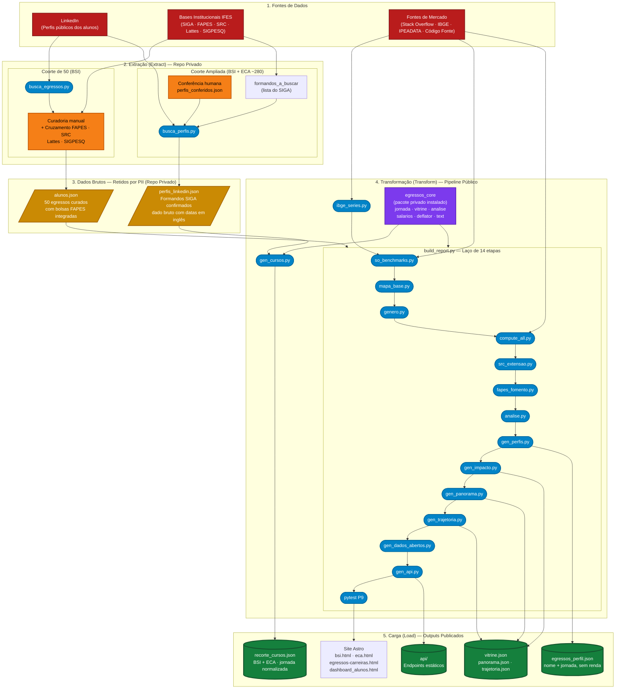
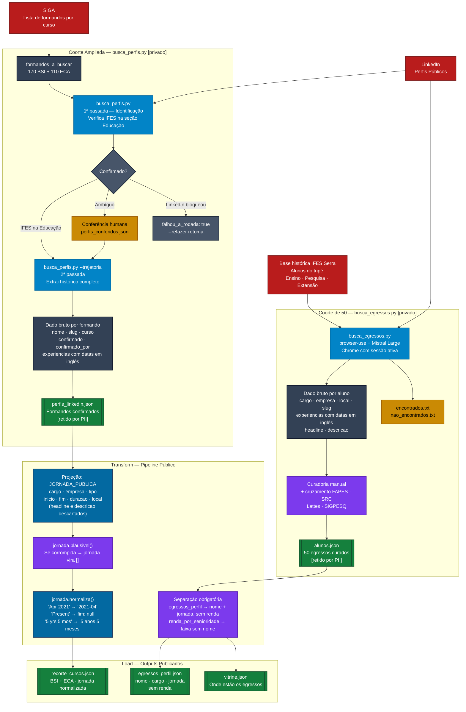

# Fontes de Dados e Scripts do ETL de Egressos

Este documento centraliza o mapeamento das fontes de dados utilizadas pelo ETL do projeto Egressos IFES Serra e lista os scripts responsáveis por cada etapa do processo (Extração, Transformação e Carga). O pipeline está dividido entre um repositório privado de desenvolvimento (`egressos-dados`, onde ficam os dados brutos, PII e a lógica de coleta) e um repositório público de publicação (`egressos`, onde ficam os scripts de orquestração e os JSONs já processados).

- A **seção 3** aprofunda especificamente a coleta via **LinkedIn** — principal fonte de dados dos alunos —, detalhando os dois scripts de coleta, o formato do dado bruto e as regras de transformação aplicadas.

---

## 1. Visão Geral do Pipeline

O fluxo completo do ETL pode ser representado da seguinte forma:

---

## 2. Fontes de Dados Mapeadas

O pipeline consome fontes de três categorias: dados institucionais do IFES (acesso restrito), o LinkedIn (plataforma pública acessada via automação com conta autenticada) e bases externas de mercado.

### 🔐 Fontes Institucionais — Acesso Restrito

1. **SIGA — Sistema Integrado de Gestão Acadêmica do IFES**
   - **O que fornece:** Lista oficial de formandos por curso, usada para montar a fila `formandos_a_buscar` da coorte ampliada.
   - **Formato:** Exportação manual (não há API pública). Alimenta diretamente o script `busca_perfis.py`.
   - **Volumes:** 170 formandos de BSI + 110 de ECA = 280 na fila inicial.

2. **FAPES / PRODEST — Fundação de Amparo à Pesquisa do Espírito Santo**
   - **O que fornece:** `relatorio_alocacao_bolsas.json` com valores reais de bolsas de iniciação científica por aluno e por período. Cobre vínculos de pesquisa que os alunos frequentemente não publicam no LinkedIn.
   - **Formato:** JSON exportado manualmente. Consumido por `fapes_fomento.py`.

3. **SRC — Sistema de Registro e Controle (IFES Serra)**
   - **O que fornece:** Participação de alunos em projetos de extensão (professores orientadores, papéis, períodos). Produzido pelo pipeline do SRC (`serra_consolidado.json`).
   - **Formato:** JSON consolidado. Consumido por `src_extensao.py`.

4. **Lattes (CNPq)**
   - **O que fornece:** Vínculos de iniciação científica, orientações e co-autorias para alunos do estudo original de 50 egressos. Consultado manualmente durante a curadoria.
   - **Formato:** Consulta manual na plataforma pública.

5. **SIGPESQ — Sistema de Pesquisa do IFES**
   - **O que fornece:** Grupos de pesquisa ativos, projetos aprovados, fellowships e participação de alunos. Banco `horizon.db`.
   - **Formato:** Consulta interna ao banco SQLite.

### 🤖 Fontes Externas — Bases de Mercado e Macro

6. **Stack Overflow Annual Developer Survey — CSVs 2018–2025**
   - **URL:** `https://survey.stackoverflow.co/`
   - **O que fornece:** Medianas salariais por país, área e anos de experiência. Base comparativa para estimar a série salarial dos egressos.
   - **Formato:** CSVs (~200 MB/edição). Consumido por `so_benchmarks.py` e `compute_all.py`.

7. **IBGE / SIDRA API**
   - **URLs:** Tabela 1737 (IPCA) e Tabela 1736 (INPC).
   - **O que fornece:** Índices mensais de inflação para deflacionar séries históricas de salário.
   - **Formato:** API REST JSON. Consumido por `ibge_series.py`.

8. **IPEADATA OData**
   - **O que fornece:** Série histórica do salário mínimo (BRL) e câmbio USD→BRL por período.
   - **Formato:** API OData. Consumido por `ibge_series.py`.

9. **Pesquisa Código Fonte (2021–2026)**
   - **O que fornece:** Benchmarks salariais do mercado de tecnologia brasileiro para validação e enriquecimento da estimativa de renda por senioridade.
   - **Formato:** CSV/Excel. Consumido por `gen_perfis.py`.

---

## 3. Coleta via LinkedIn — Detalhamento

Esta seção detalha especificamente como os dados dos alunos são coletados no LinkedIn, abrangendo as duas populações do projeto. 

### 3.1 Infraestrutura de coleta

A coleta não usa a API oficial do LinkedIn (que não dá acesso a perfis de terceiros). Usa **automação de navegador real**:

| Componente | Papel |
|---|---|
| Google Chrome | Navegador com sessão ativa e autenticada no LinkedIn |
| `browser-use` | Framework Python de automação de navegador baseado em IA |
| Mistral Large | LLM que age como agente de extração — interpreta o HTML renderizado e preenche campos estruturados |

> **Nota de privacidade:** Apenas nomes de empresas (pessoas jurídicas) são enviados ao Mistral. Nomes de pessoas nunca saem para serviço externo.

### 3.2 Coorte de 50 — `busca_egressos.py`

Aplicado ao grupo original de 50 egressos do estudo principal, todos do curso de BSI.

**Origem da lista:** curadoria histórica manual de alunos que passaram pelo tripé institucional (ensino/monitoria, pesquisa com bolsa FAPES, extensão no LEDS/Morpheus Jr.).

**Processo de coleta:**
1. O script acessa o perfil de cada egresso diretamente (a URL já é conhecida ou buscada por nome).
2. O agente Mistral extrai os seguintes campos:

| Campo | Tipo | Observação |
|---|---|---|
| `nome` | `str` | Nome completo conforme LinkedIn |
| `cargo_atual` | `str` | Cargo em destaque no perfil |
| `empresa_atual` | `str` | Empresa atual |
| `local` | `str` | Localidade declarada |
| `slug` | `str` | Identificador da URL (`in/<slug>`) |
| `headline` | `str` | Texto livre de apresentação — **descartado no ETL** |
| `experiencias[]` | `list` | Lista de posições profissionais (ver abaixo) |

**Campos de cada experiência extraída:**

| Campo | Exemplo bruto (dado cru) |
|---|---|
| `cargo` | `"Software Engineer -> -"` (sujeira de seletor HTML) |
| `empresa` | `"Vale"` |
| `tipo` | `"Full-time"` ou `"Integral"` (misto inglês/português) |
| `inicio` | `"Apr 2021"` (inglês textual, formato LinkedIn) |
| `fim` | `"Present"` ou `"Oct 2023"` |
| `duracao` | `"5 yrs 5 mos"` |
| `local` | `"Vitória, Espírito Santo, Brazil"` |
| `descricao` | Texto livre da vaga — **descartado no ETL** |

**Rastreabilidade:** O script mantém dois arquivos de controle: `encontrados.txt` e `nao_encontrados.txt`.

**Após a coleta:** Os dados passam por curadoria manual e cruzamento com FAPES, SRC, Lattes e SIGPESQ — cobrindo períodos de bolsa e projetos que os alunos frequentemente não publicam no LinkedIn. O resultado é o arquivo `alunos.json` (retido no repo privado).

### 3.3 Coorte Ampliada — `busca_perfis.py`

Aplicado aos ~280 formandos exportados do SIGA (170 BSI + 110 ECA).

**Processo em duas passadas:**

**1ª passada — Identificação:**
- O script busca o nome do aluno no LinkedIn.
- Verifica se a seção **Educação** do perfil contém `"IFES"` ou `"Instituto Federal do Espírito Santo"`.
- Extrai apenas o topo do perfil: `cargo_atual` e `empresa_atual`.
- Registra `confirmado: true` e `confirmado_por: "IFES lido"` se a verificação passou automaticamente.

**Caminhos possíveis após a 1ª passada:**

| Situação | Destino |
|---|---|
| IFES identificado automaticamente na Educação | Segue direto para a 2ª passada |
| Nome ambíguo ou homônimo | Vai para `perfis_conferidos.json` — conferência humana confirma ou descarta |
| LinkedIn bloqueou a leitura | Marcado como `falhou_a_rodada: true`; retomado com `--refazer` |

**2ª passada — Trajetória (`--trajetoria`):**
- Entra no perfil confirmado.
- Extrai o histórico completo de experiências (mesmo schema de campos da coorte de 50).
- Resultado gravado em `perfis_linkedin.json` (retido no repo privado por PII).

### 3.4 Anomalias documentadas na coleta

| Anomalia | Frequência | Tratamento |
|---|---|---|
| Sujeira de seletor HTML no campo `cargo` (ex: `"-> -"`) | 20 em 150 posições na primeira coleta | `jornada.plausivel()` rejeita a jornada inteira |
| Datas e durações em inglês (`"Apr 2021"`, `"Present"`, `"5 yrs 5 mos"`) | Todas as posições | `jornada.normaliza()` traduz para `"2021-04"`, `null`, `"5 anos 5 meses"` |
| Tipo de contrato em idioma variável (`"Full-time"` vs `"Integral"`) | Frequente | **Não normalizado** — passa como veio |
| Homônimos (nome idêntico a outra pessoa no LinkedIn) | Não quantificado | `perfis_conferidos.json` + conferência humana |
| LinkedIn bloqueou a leitura na rodada | 1 no BSI | `falhou_a_rodada: true`; `--refazer` retoma |

### 3.5 O que é descartado na transformação

Os campos a seguir existem no dado bruto mas são **explicitamente suprimidos** antes de qualquer publicação:

- **`headline`** — texto livre de apresentação do perfil. Pode conter comentários sobre terceiros não revisados.
- **`descricao`** — texto livre de cada vaga. Mesmo motivo.

A constante `JORNADA_PUBLICA` em `gen_cursos.py` (linha 104) é a lista exata dos campos que saem: `cargo`, `empresa`, `tipo`, `inicio`, `fim`, `duracao`, `local`.

### 3.6 Fluxo visual da coleta LinkedIn

---

## 4. Scripts do ETL Identificados

### 📥 Coleta / Extração (Repo Privado — não disponível no repo público)

| Script | Responsabilidade |
|---|---|
| `busca_egressos.py` | Coleta LinkedIn dos 50 egressos do estudo original via browser-use + Mistral Large. Mantém `encontrados.txt` e `nao_encontrados.txt` para rastreabilidade. |
| `busca_perfis.py` | Coleta LinkedIn dos formandos do SIGA. Suporta flags `--trajetoria` (2ª passada) e `--refazer` (retoma perfis que falharam). |

### 🔄 Transformação — Etapa Privada (Repo Privado)

| Componente | Responsabilidade |
|---|---|
| `egressos_core` | Pacote Python privado. Motor de todas as regras de negócio, estatística e privacidade. Inclui os módulos: `dados`, `deflator`, `vitrine`, `analise`, `salarios`, `jornada`, `text`, `genero`, `paths`. |
| Curadoria manual | Enriquece os dados dos 50 egressos com vínculos de FAPES, SRC, Lattes e SIGPESQ. Produz `alunos.json`. |

### 🔄 Transformação — Pipeline Público (`pipeline/`)

Os scripts abaixo são **cascas de orquestração**: leem os JSONs de entrada, delegam toda a lógica ao `egressos_core` e gravam os JSONs de saída. A regra de negócio não vive aqui.

| Script | Etapa | O que produz |
|---|---|---|
| `ibge_series.py` | Pré-laço (obrigatório primeiro) | `ibge_series.json`, `salario_minimo.json`, objeto `Competencia` (data de referência do build) |
| `so_benchmarks.py` | Etapa 1 | `so_benchmarks.json` — medianas Stack Overflow por país e experiência |
| `mapa_base.py` | Etapa 2 | `mapa_mundi.json` — contorno SVG do mapa-múndi |
| `genero.py` | Etapa 3 | `genero_map.json` — inferência de gênero offline por nome |
| `compute_all.py` | Etapa 4 | `consolidado.json` — série salarial estimada por egresso (alunos × mercado × IPCA × câmbio) |
| `src_extensao.py` | Etapa 5 | `src_extensao.json` — cruza alunos × projetos SRC por nome |
| `fapes_fomento.py` | Etapa 6 | `fapes_fomento.json` — agrega bolsas FAPES com deflação por IPCA |
| `analise.py` | Etapa 7 | `analise.json` — K-Means, Sankey, clusters de trajetória |
| `gen_perfis.py` | Etapa 8 | `egressos_perfil.json` (nome + jornada, **sem renda**) e `renda_por_senioridade.json` (faixa de mercado, **sem nome**) |
| `gen_impacto.py` | Etapa 9 | `impacto.json` — dataset do painel de impacto |
| `gen_panorama.py` | Etapa 10 | `panorama.json` — timeline anonimizada (labels A–AX) |
| `gen_trajetoria.py` | Etapa 11 | `trajetoria.json` — série anual + CAGR real |
| `gen_dados_abertos.py` | Etapa 12 | Catálogo público de dados abertos |
| `gen_api.py` | Etapa 13 | Endpoints estáticos em `api/` |
| `gen_cursos.py` | Fora do laço | `recorte_cursos.json` — normaliza a coleta ampliada (BSI + ECA): traduz datas do inglês, limpa sujeira de HTML, aplica regras de plausibilidade |

### 📦 Orquestração e Validação

| Script | Responsabilidade |
|---|---|
| `build_report.py` | Orquestrador principal. Resolve a data de referência (`Competencia`) uma única vez a partir do `ibge_series.json` e a repassa a todas as 14 etapas. Executa o laço `ETAPAS` na ordem estrita. Flag `--publish` aciona o build do Astro após a validação. |
| `pytest tests/test_projecao_impacto.py` (P9) | Portão de qualidade. Verifica se os números publicados no site batem com os datasets que os originaram. Falha se houver divergência. Roda também no CI. |
