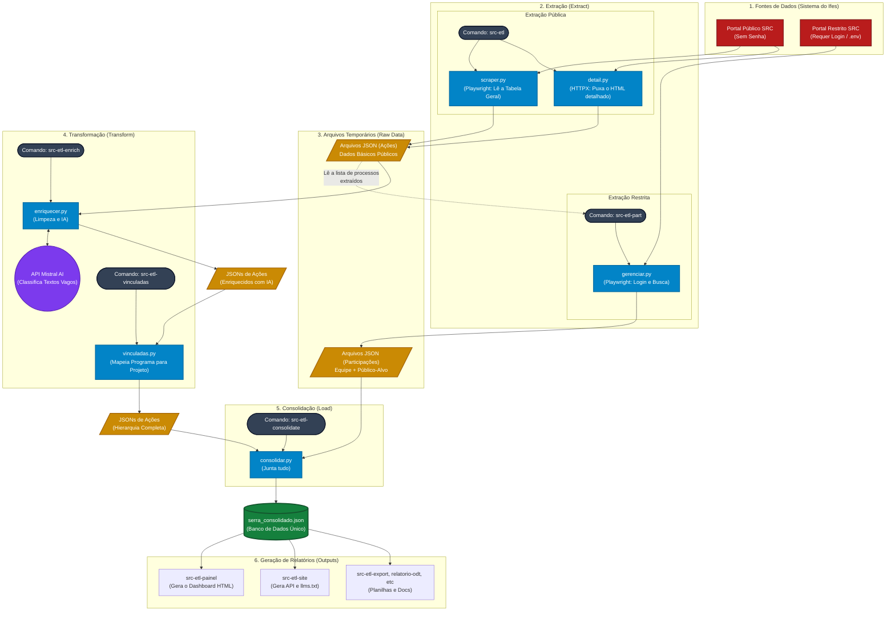

# Documentação: Fontes de Dados e Scripts do ETL (Base SRC)

Este documento centraliza o mapeamento das fontes de dados utilizadas pelo ETL do SRC/IFES e lista os scripts em Python responsáveis por cada etapa do processo (Extração, Transformação e Consolidação).

---

## 1. Visão Geral do Pipeline

O fluxo completo do ETL pode ser representado da seguinte forma:

---

## 2. Fontes de Dados Mapeadas

Os dados consumidos pelo pipeline têm origens diferentes dentro do sistema SRC, dividindo-se entre áreas de acesso público e áreas que exigem autenticação institucional.

### 🔓 Fontes Públicas (Sem necessidade de login)

1. **Consulta Pública de Ações:**

   * **URL:** `https://src.ifes.edu.br/src/public/consulta-acao.xhtml`
   * **O que fornece:** Listagem completa e paginada de todas as ações de extensão e ensino registradas no campus. Fornece os IDs únicos (`acao_id`) necessários para as próximas etapas.
   * **Tecnologia de acesso:** Playwright (necessário para interagir com a interface JSF/PrimeFaces).

2. **Detalhe da Ação:**

   * **URL:** `https://src.ifes.edu.br/src/public/detalhe-acao.xhtml?id={acao_id}`
   * **O que fornece:** Dados descritivos da ação (Título, Tipo, Coordenador, Grande Área, Área Temática, Fomento, Processo).
   * **Tecnologia de acesso:** Requisição HTTP direta via `httpx`.

### 🔐 Fontes Autenticadas (Exigem login com credenciais do SRC)

3. **Gerenciamento de Público-Alvo:**

   * **URL:** `https://src.ifes.edu.br/src/pages/gerenciar/gerenciar-publico-alvo.xhtml?atividade={id}`
   * **O que fornece:** Dados quantitativos e nominais dos alunos atendidos (aprovados, certificados, situação). *Atenção: contém PII (Dados Pessoais).*
   * **Tecnologia de acesso:** Playwright mantendo sessão autenticada.

4. **Gerenciamento de Equipe de Execução:**

   * **URL:** `https://src.ifes.edu.br/src/pages/gerenciar/gerenciar-equipe-execucao.xhtml?atividade={id}`
   * **O que fornece:** Lista de professores, bolsistas e voluntários envolvidos na ação e suas funções.
   * **Tecnologia de acesso:** Playwright mantendo sessão autenticada.

### 🤖 Fontes Externas (APIs)

5. **Mistral AI (Opcional):**

   * **URL:** `https://api.mistral.ai/v1/chat/completions`
   * **O que fornece:** Inferência e preenchimento de campos de categorias que vêm vazios do SRC (Grande Área e Área Temática) baseando-se no título da ação.

---

## 3. Scripts do ETL Identificados

O código fonte (localizado na pasta `src/src_etl/etl/`) é dividido por responsabilidades claras.

### 📥 Extração (Extract)

* **`scraper.py`**: Interage com o portal público (Fonte 1), navega pelas páginas do campus e extrai os IDs das ações.
* **`detail.py`**: Acessa a página de detalhes de cada ação (Fonte 2) e converte o HTML em um dicionário de dados (título, coordenador, etc).
* **`gerenciar.py`**: Cuida do fluxo com login. Busca as ações pelo número do processo e extrai as participações e público-alvo (Fontes 3 e 4).

### 🔄 Transformação (Transform)

* **`models.py`**: Não executa extração, mas atua como a camada de tipagem e validação (Pydantic). Garante que todos os dados extraídos estejam no formato correto antes de serem salvos.
* **`enriquecer.py`**: Comunica-se com a API do Mistral (Fonte 5) para preencher categorias faltantes sem sobrescrever dados existentes.
* **`vinculadas.py`**: Resolve o auto-relacionamento entre ações, identificando quais ações são "programas guarda-chuva" e anexando as ações filhas a eles.

### 📦 Consolidação e Orquestração

* **`consolidar.py`**: O motor de junção. Lê os arquivos JSON de ações (gerados pelos scripts públicos) e os JSONs de participação (gerados pelos scripts autenticados) e mescla tudo em um único arquivo mestre (`serra_consolidado.json`).
* **`pipeline.py`**: O maestro do fluxo. Orquestra a ordem de execução, chamando o *scraper*, depois o *detail*, resolvendo os campi e paralelizando o trabalho via workers.
