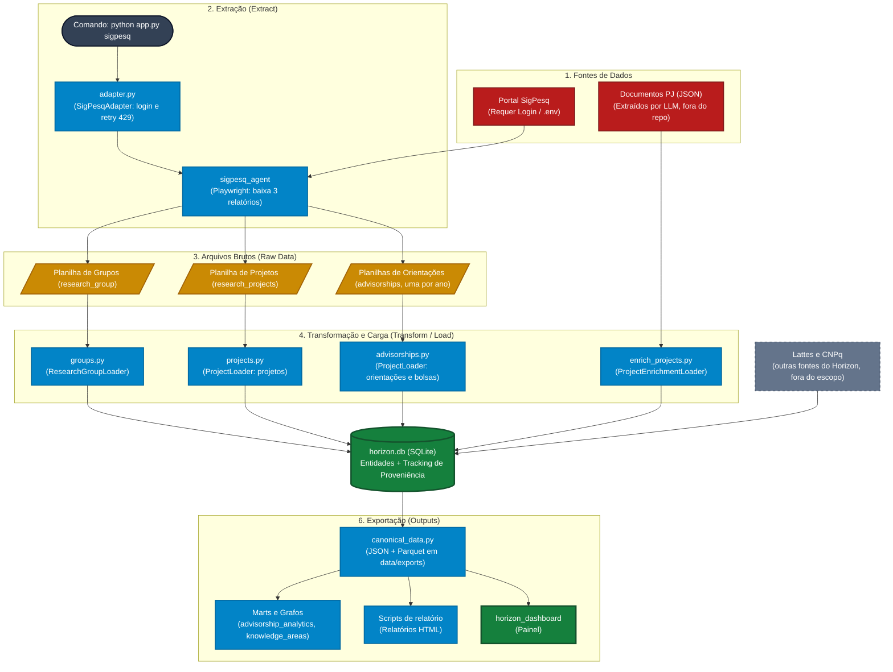

# Documentação: Fontes de Dados e Scripts do ETL (Horizon ETL – SigPesq)

Este documento centraliza o mapeamento das fontes de dados do SigPesq utilizadas pelo Horizon ETL (`ifesserra-lab/horizon_etl`) e lista os scripts em Python responsáveis por cada etapa do processo (Extração, Transformação e Carga). A análise foi feita sobre o commit `b45ac2f` e a biblioteca `sigpesq_agent` v0.3.2.

O Horizon ETL também ingere dados da Plataforma Lattes e do Diretório de Grupos do CNPq. Essas fontes aparecem aqui apenas como um bloco do fluxo; o foco deste documento é o SigPesq.

---

## 1. Visão Geral do Pipeline

O fluxo do ETL do SigPesq pode ser representado da seguinte forma:



---

## 2. Fontes de Dados Mapeadas

Os dados do SigPesq só podem ser obtidos com autenticação institucional. Os documentos de projeto (PJ) são arquivos gerados fora do repositório.

### Fontes Autenticadas (Exigem login com credenciais do SigPesq)

1. **Relatório de Grupos de Pesquisa:**

   * **URL:** `https://sigpesq.ifes.edu.br/web/relatorio/lista.aspx` (seção "Grupos de Pesquisa", botão `ContentPlaceHolder_btnRel_GruposPesquisa`)
   * **O que fornece:** Planilha Excel com todos os grupos de pesquisa do Ifes: nome, sigla, campus (`Unidade`), área do conhecimento, URL do espelho no CNPq (`Column1`) e líderes com e-mail.
   * **Tecnologia de acesso:** Playwright (`sigpesq_agent`), com sessão autenticada.

2. **Relatório de Projetos de Pesquisa:**

   * **URL:** mesma página de relatórios (seção "Projetos de Pesquisa", botão `ContentPlaceHolder_btnRel_Projetos`)
   * **O que fornece:** Planilha Excel com os projetos aprovados: código, título, datas, coordenador, pesquisadores, estudantes, grupo de pesquisa, palavras-chave e parceiros.
   * **Tecnologia de acesso:** Playwright, com sessão autenticada.

3. **Relatório de Orientações:**

   * **URL:** mesma página de relatórios (seção "Orientações", botão `ContentPlaceHolder_btnRel_Orientacoes`, um download por ano do seletor `ContentPlaceHolder_ddlRelOrientacao_Ano`)
   * **O que fornece:** Uma planilha por ano com os planos de trabalho: aluno, orientador, projeto pai, programa de bolsa, valor, agência financiadora, cancelamento, edital e curso. *Atenção: contém PII (CPF, e-mail e celular).*
   * **Tecnologia de acesso:** Playwright, com sessão autenticada.

   **Observação:** o login no portal funciona com qualquer conta do SigPesq, mas os relatórios só ficam disponíveis para perfis com permissão de gestão. Sem essa permissão, a extração falha.

### Fontes Externas (Arquivos)

4. **Documentos de Projeto (PJ):**

   * **Local:** `data/exports/project_sigpesq_files_json/`
   * **O que fornece:** Conteúdo dos planos de projeto do SigPesq (descrição, objetivos, cronograma, linha de pesquisa, palavras-chave), extraído por LLM de PDFs e DOCs por um processo externo. Os arquivos não estão no repositório; sem eles, a etapa de enriquecimento não faz nada.

---

## 3. Scripts do ETL Identificados

O código fonte fica em `src/`, dividido entre `adapters` (fontes externas), `core/logic` (regras de negócio), `flows` (orquestração Prefect) e `scripts` (relatórios).

### Extração (Extract)

* **`src/adapters/sources/sigpesq/adapter.py`**: `SigPesqAdapter`. Valida as credenciais (`SIGPESQ_USERNAME`/`SIGPESQ_PASSWORD`), limpa `data/raw/sigpesq/`, dispara o `sigpesq_agent` e tenta de novo com espera crescente (60 s, 120 s) quando o portal responde HTTP 429.
* **`sigpesq_agent`** (biblioteca externa): `SigpesqReportService` faz o login e executa as três estratégias de download (`ResearchGroupsDownloadStrategy`, `ProjectsDownloadStrategy`, `AdvisorshipsDownloadStrategy`).

### Transformação (Transform)

* **`src/core/logic/strategies/sigpesq_excel.py`**: mapeia as colunas da planilha de grupos e interpreta a coluna `Lideres` ("Nome (e-mail)").
* **`src/core/logic/strategies/sigpesq_projects.py`**: mapeia as colunas da planilha de projetos, calcula o status (Active/Concluded) e monta a chave de identidade pelo código do projeto.
* **`src/core/logic/strategies/sigpesq_advisorships.py`**: mapeia as colunas das planilhas de orientações e trata cancelamento, bolsa (programa, valor, agência) e o vínculo com o projeto pai.
* **`src/core/logic/strategies/base.py`**: interfaces das estratégias e funções comuns de datas, nomes e moeda ("700,00" para 700.0).
* **`src/core/logic/person_matcher.py`**: encontra ou cria pessoas por e-mail, nome normalizado e similaridade de nome, evitando duplicatas.
* **`src/core/logic/initiative_identity.py`**: normalização de texto e chaves de identidade (ex.: `sigpesq_project|6903`).
* **`src/core/logic/pii_anonymizer.py`** e **`pii_session_hook.py`**: anonimização LGPD. E-mails e CPFs são gravados como hash e celulares são descartados.

### Carga e Consolidação (Load)

* **`src/core/logic/research_group_loader.py`**: grava grupos, campi, áreas e líderes. Grupos já existentes não são alterados, exceto a URL do CNPq (ADR 001).
* **`src/core/logic/project_loader.py`**: faz o UPSERT de projetos e orientações, cria o projeto pai quando ele não existe e recalcula as datas e o status dos projetos pai.
* **`src/core/logic/initiative_handlers.py`**: `StandardProjectHandler` (projetos) e `AdvisorshipHandler` (orientações, bolsas, aluno e orientador).
* **`src/core/logic/initiative_linker.py`** e **`team_synchronizer.py`**: equipes dos projetos, vínculo com grupos de pesquisa e palavras-chave como áreas do conhecimento.
* **`src/core/logic/project_enrichment.py`**: `ProjectEnrichmentLoader`, que completa os projetos com os documentos PJ (casamento por código, título exato ou título similar).
* **`src/tracking/`**: registra a proveniência de cada linha (`source_records`, `entity_matches`, `attribute_assertions`, `entity_change_logs`).

### Orquestração e Saídas

* **`src/flows/sigpesq/all.py`**: flow `Ingest SigPesq Full`, com um único login, três downloads e três cargas.
* **`src/flows/sigpesq/groups.py`**, **`projects.py`**, **`advisorships.py`**, **`enrich_projects.py`**: tasks de carga de cada relatório e o flow de enriquecimento.
* **`src/flows/pipelines/unified.py`** e **`weekly_orchestrator.py`**: pipelines completos do Horizon. O SigPesq roda primeiro, antes de Lattes e CNPq; o enriquecimento roda depois deles.
* **`src/core/logic/canonical_exporter.py`** e **`src/flows/exports/`**: geram os `*_canonical.json`, os marts e os grafos em `data/exports/`, também em Parquet.
* **`app.py`**: ponto de entrada da linha de comando; instala o hook de anonimização LGPD antes de qualquer gravação.

---

## 4. Execução Local

A execução completa depende de uma conta do SigPesq com permissão de relatórios. Sem essa permissão, a carga foi executada a partir das planilhas de 18/05/2026 reconstruídas do snapshot versionado em `data/exports/exports_canonical.zip`, sem login no portal:

```bash
make setup
.venv/bin/python -m playwright install --with-deps chromium
cp .env.example .env            # DATABASE_URL=sqlite:///db/horizon.db, STORAGE_TYPE=db
unzip sigpesq_raw_snapshot.zip  # cria data/raw/sigpesq/...
make db-reset
make prefect-server             # ou: .venv/bin/prefect server start
PYTHONPATH=. .venv/bin/python carga_sigpesq_local.py
```

Resultado (cerca de 3 minutos, sem erros):

| Etapa | Linhas lidas | Principais registros criados |
| --- | --- | --- |
| Grupos | 340 | 339 grupos, 453 pesquisadores, 50 áreas, 23 campi |
| Projetos | 81 | 80 projetos, 236 pessoas, 303 áreas (palavras-chave) |
| Orientações | 642 (11 planilhas) | 519 orientações, 130 projetos pai, 18 bolsas, 268 pessoas |

---

## 5. Pontos de Atenção Identificados

* Planos de trabalho com o mesmo título em anos diferentes são fundidos: 521 planos nas planilhas viraram 519 orientações no banco.
* O valor da bolsa é guardado por programa + agência, não por plano. PIBIC/Fapes aparece com valores de 400 a 900 na planilha, mas o banco guarda um só.
* Nenhum projeto tem descrição, porque a planilha de projetos não tem a coluna `Resumo`.
* O CPF do aluno (`OrientadoCpf`) está preenchido em todas as linhas, mas não é gravado na pessoa. Gravar o hash permitiria cruzar com outras bases (ex.: SRC).
* A URL do CNPq de cada grupo vem da planilha do SigPesq; sem ela, a sincronização com o CNPq fica sem grupos para atualizar.
