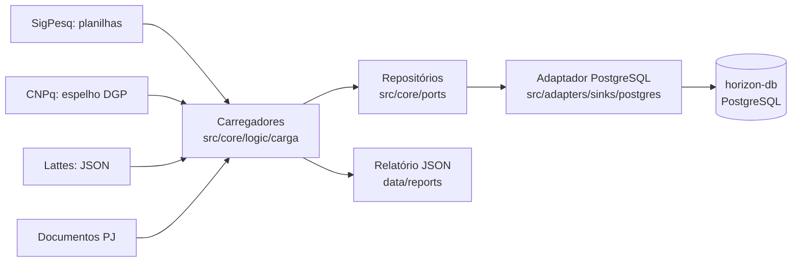

# Relatório: novo ETL do Horizon (carga em PostgreSQL)

## 1. Objetivo

O Horizon será unido às bases SRC, Editais, Diretoria e Egressos no painel do Campus Serra. Por isso a **carga** do ETL passou a gravar num PostgreSQL em Docker, com as 33 tabelas de `ModeloLogicoHorizon.sql`. A extração, o parsing e o casamento de pessoas foram mantidos.

## 2. Como funciona



Cada execução (`make pipeline-postgres`) segue esta ordem:

1. **Recarga completa:** recria o schema a partir do `.sql`, com os dados iniciais (IFES, papéis, tipos).
2. **SigPesq:** grupos → projetos → bolsistas (orientações).
3. **CNPq:** nome, descrição, data de formação, membros, líderes e linhas de pesquisa dos grupos.
4. **Lattes:** donos dos currículos → currículos (prêmios, idiomas, vínculos, formações, artigos, produções, projetos) → orientações.
5. **Documentos PJ:** preenche descrição vazia e cria projetos sem par.
6. **Relatório:** contagens, registros pulados, campos descartados e itens para revisar.

**Transações:** cada passo faz commit no fim; cada registro roda num savepoint. Um registro com erro é desfeito, entra no relatório e a carga continua.

## 3. Antes e depois

| Aspecto | Antes | Agora |
|---|---|---|
| Destino | SQLite `db/horizon.db` | PostgreSQL em Docker (`horizon-db`, porta 5434) |
| Modelo | Tabelas das libs `research_domain` e `eo_lib` (inglês) | 33 tabelas de `ModeloLogicoHorizon.sql` (português) |
| Gravação | Controllers das libs, `session.add` e SQL cru dentro dos loaders | Repositórios por família atrás de portas (`src/core/ports`) |
| Porta `ISink` | Existia, sem uso | Substituída por portas por família, em português |
| Schema | `Base.metadata.create_all` | `.sql` intacto + ajustes aplicados na criação (`src/db/sql/`) |
| Limpeza | `make db-reset` manual | 1º passo do pipeline (recarga completa) |
| Erros | Linha com erro era ignorada no log | Savepoint por registro + relatório JSON |
| Rastreamento | 5 tabelas de auditoria | Desligado (fora do diagrama) |
| Exports, marts e grafos | Gerados no pipeline | Fora do escopo (a reescrever) |
| Pipeline | `full_ingestion_pipeline` | `Horizon Pipeline PostgreSQL` (o antigo segue intacto) |

## 4. Decisões de código

- **Carregadores novos ao lado dos antigos**, em vez de editar os loaders. O pipeline SQLite continua funcionando e permite comparar contagens.
- **Reaproveitado sem mudança:** adaptadores de fonte, `LattesParser`, `map_row` das estratégias, `PersonMatcher`, `initiative_identity`.
- **`PersonMatcher` ligado ao banco novo** por um adaptador pequeno (`carga/pessoas.py`).
- **Repositórios não fazem commit.** Quem chama controla a transação, e casos esperados (e-mail ou prêmio repetido) devolvem `False` em vez de erro de banco.
- **Sem cache nos repositórios:** um rollback deixaria o cache errado.
- **Regras em um só lugar:** `carga/regras.py` (situação, proficiência, datas, papéis do CNPq).
- **Persistência nova em português**; o resto do código segue em inglês.

## 5. Como rodar

```bash
make horizon-db-up          # sobe o PostgreSQL
make pipeline-postgres CAMPUS=Serra            # baixa o SigPesq e carrega tudo
make pipeline-postgres SEM_DOWNLOAD=1          # usa as planilhas já em data/raw/sigpesq
make horizon-db-schema      # só recria o schema (apaga os dados)
```

Variáveis em `.env`: `HORIZON_DATABASE_URL` e `HORIZON_DB_*` (modelo em `.env.example`).

## 6. Verificação

- **Testes:** 412 passam. As 6 falhas existiam antes da migração (download Lattes, export com rastreamento, mapeamento de grupos, login SigPesq com erro 429).
- **Execução real** do flow pelo servidor Prefect do Docker: terminou em `Completed`, mas sem dados de entrada.
- **Não verificado:** carga com dados reais, comparação com o pipeline antigo e o container `app`.

## 7. Limites conhecidos

- Os exports e o `horizon_dashboard` ainda leem o formato antigo.
- O modo sem servidor do Prefect quebra no `.venv` (FastAPI e Starlette novos demais). Use o servidor do Docker (`make prefect-server`).
- Instituição escrita só com sigla (ex.: "UFES") vira `empresa` na regra pelo nome.
- Campos descartados por não terem coluna: Valor Aprovado, conteúdo dos documentos PJ, dados de cancelamento, tipo e instituição da orientação do Lattes, detalhes da atuação profissional.
