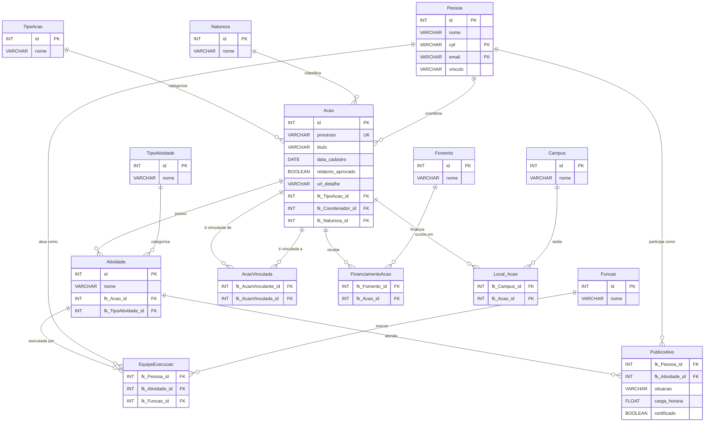

# Modelo de Dados — SRC/Ifes

> **Sistema:** SRC — Sistema de Registro e Emissão de Certificados do Ifes  
> **Fonte:** Portal público + extração autenticada
> **Estrutura:** Banco de Dados Relacional Normalizado (PostgreSQL)

---

## Diagrama Entidade-Relacionamento (Físico)

## Dicionário de Tabelas

- **Pessoa**: Cadastro unificado de todas as pessoas (Coordenadores, Equipe e Público-Alvo). Usa deduplicação por CPF ou E-mail.
- **Acao**: A entidade central (Projetos, Cursos, Eventos). Contém os metadados públicos e é a raiz para todas as outras amarrações.
- **Atividade**: Turmas, módulos ou ações filhas diretas de uma Ação. Onde as pessoas realmente são alocadas.
- **Tabelas de Domínio (Lookups)**: `TipoAcao`, `TipoAtividade`, `Natureza`, `Fomento`, `Campus`, `Funcao`. Armazenam valores únicos para evitar redundância de strings.
- **Tabelas Associativas M:N**:
  - `AcaoVinculada`: Auto-relacionamento de Ações (Ação guarda-chuva / Ação filha).
  - `FinanciamentoAcao`: Relaciona uma Ação a múltiplos Fomentos e vice-versa.
  - `Local_Acao`: Relaciona uma Ação a múltiplos Campi e vice-versa.
  - `EquipeExecucao`: Relaciona a Pessoa, a Atividade e a Função (Membro da equipe).
  - `PublicoAlvo`: Relaciona a Pessoa e a Atividade guardando as métricas de conclusão (Carga horária, Situação, Certificado).
